# wm-xcb

This is not a window manager, yet.

This is an experiment at writing a minimal window manager using xcb bindings.

---

# Overview

<details>
<summary>Relevant source files</summary>

The following files were used as context for generating this wiki page:

- [Makefile](Makefile)
- [wm-xcb.c](wm-xcb.c)
- [wm.c](wm.c)

</details>


This page provides a comprehensive introduction to wm-xcb, a lightweight X11 window manager built using the XCB (X C Binding) library. The purpose of this document is to offer a high-level understanding of the window manager's architecture, components, and how they interact to manage windows in an X11 environment.

For specific details about building and running the window manager, see [Building and Running](#1.2). For information about the state machine implementation, see [State Machine](#5.2).

## Purpose and Scope

wm-xcb is a minimalist X11 window manager designed for efficiency and simplicity. It focuses on core window management functionality including:

- Window creation, destruction, and management
- Event handling for user interaction (keyboard and mouse input)
- Window state management through a state machine
- Support for Extended Window Manager Hints (EWMH)

The window manager follows a modular design with clean separation of concerns between components, making it both maintainable and extensible.

Sources: [wm.c:1-27](), [Makefile:1-33]()

## System Architecture

The window manager is structured around several core components that work together to provide window management functionality.

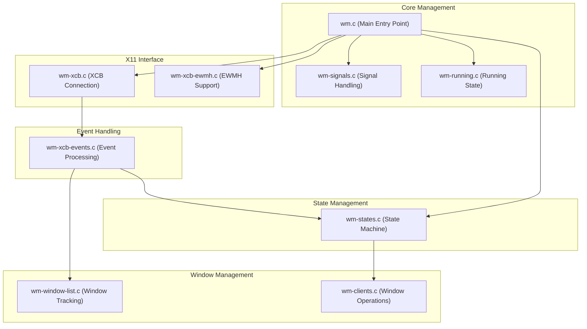

Sources: [wm.c:15-27](), [wm-xcb.c:109-139]()

## Execution Flow

The window manager follows a straightforward execution flow from initialization to event handling.

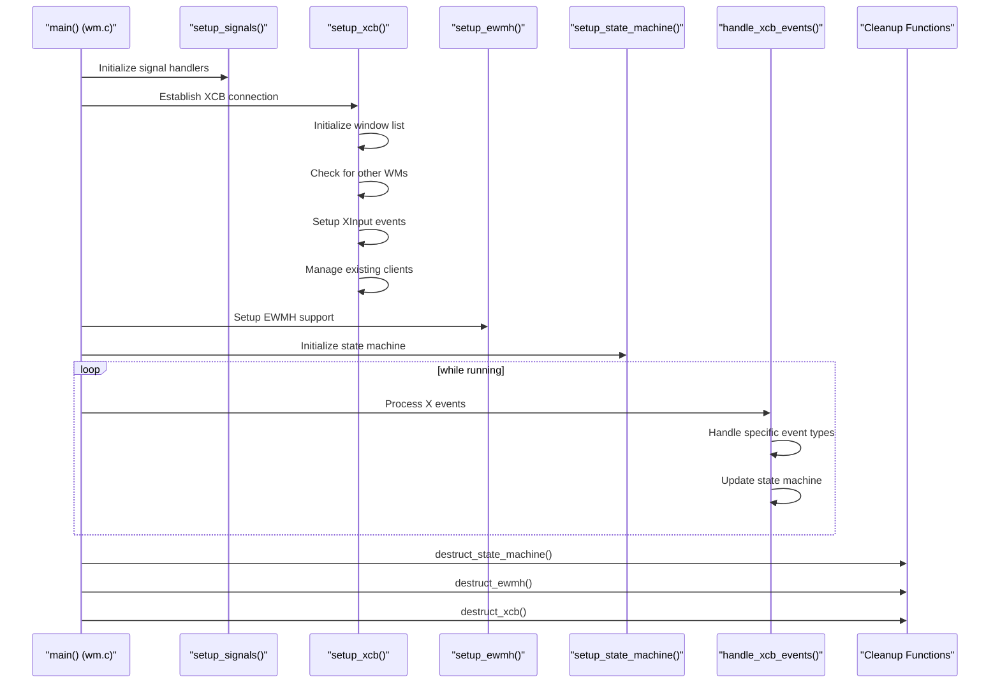

Sources: [wm.c:15-27](), [wm-xcb.c:109-139](), [wm-xcb.c:206-300]()

## Key Components

### Core Management

The core management components are responsible for the overall control flow of the window manager:

- **Main Entry Point** (`wm.c`): Initializes the system and runs the main event loop
- **Signal Handling** (`wm-signals.c`): Sets up handlers for system signals like SIGINT and SIGTERM
- **Running State** (`wm-running.c`): Maintains the global running state of the application

Sources: [wm.c:15-27]()

### X11 Interface Layer

The X11 interface layer manages communication with the X server:

- **XCB Connection** (`wm-xcb.c`): Establishes and manages the connection to the X server
- **EWMH Support** (`wm-xcb-ewmh.c`): Implements Extended Window Manager Hints for interoperability

The XCB connection component is particularly important as it:
- Connects to the X display
- Gets the root window
- Sets up XInput for advanced input handling
- Checks that no other window manager is running
- Captures X events for the root window

Sources: [wm-xcb.c:109-139](), [wm-xcb.c:32-53]()

### Event Handling System

The event handling system processes events from the X server:

- **Event Processing** (`wm-xcb-events.c`): Contains handlers for different types of X events
- **Event Loop** (`wm-xcb.c:handle_xcb_events`): Polls for X events and dispatches them to appropriate handlers

The window manager handles a wide range of events including:
- Window creation and destruction
- Window mapping and unmapping
- Property changes
- Input events (keyboard, mouse, touch)

Sources: [wm-xcb.c:206-300]()

### Window Management

The window management components track and manipulate windows:

- **Window Tracking** (`wm-window-list.c`): Maintains a doubly-linked list of managed windows
- **Window Operations** (`wm-clients.c`): Provides functions to configure, show, and hide windows

When the window manager starts, it:
1. Creates a list to track all windows
2. Queries the X server for existing windows
3. Takes control of these windows (reparenting them to the root window)
4. Sets up event masks to receive notifications about window changes

Sources: [wm-xcb.c:146-204]()

### State Management

The state management component implements the window manager's behavior:

- **State Machine** (`wm-states.c`): Defines states and transitions for the window manager
- **Configuration** (`config.def.h`): Contains user-configurable state transitions

The state machine is driven by X events and determines how the window manager responds to user input.

Sources: [wm-xcb.c:297]()

## Data Structures

The window manager uses several key data structures to track windows and state:

```mermaid
classDiagram
    class "wnd_node_t" {
        +xcb_window_t window
        +char* title
        +xcb_window_t parent
        +int16_t x, y
        +uint16_t width, height
        +uint16_t border_width
        +uint8_t stack_mode
        +uint8_t mapped
        +wnd_node_t* next
        +wnd_node_t* prev
    }

    class "Context" {
        +State state
        +WndType window_target_type
        +EventType event_type
        +ModKey key_mod, btn_mod
        +xcb_window_t root, child
        +int16_t event_x, event_y
    }

    "wnd_node_t" --> "wnd_node_t": next/prev
```

This diagram shows:
1. The window node structure that forms a doubly-linked list of managed windows
2. The context structure that holds the current state and event information for the state machine

Sources: [wm-window-list.c]() (inferred from its use in the codebase)

## Event Processing

The window manager processes X events through a central event handling function and dispatches them to specialized handlers:

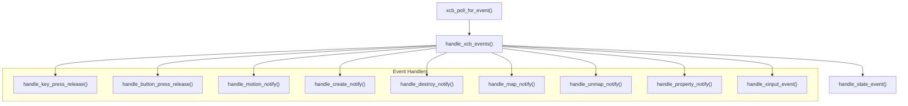

Sources: [wm-xcb.c:206-300]()

## Summary

wm-xcb is a modular X11 window manager that follows a clean, event-driven architecture. It separates concerns into distinct components for state management, event handling, window tracking, and X server communication. The window manager initializes by connecting to the X server, setting up event handlers, and entering an event loop to process and respond to X events.

Key features of the architecture include:
- Modular design with separation of concerns
- Event-driven architecture
- State machine for handling input and window operations
- Comprehensive X event handling
- Window tracking through a doubly-linked list
- Support for EWMH standards

This overview provides a foundation for understanding the more detailed documentation about specific components and subsystems in the window manager.

Sources: [wm.c:1-27](), [wm-xcb.c:1-301]()
# Architecture Overview

<details>
<summary>Relevant source files</summary>

The following files were used as context for generating this wiki page:

- [wm-states.c](wm-states.c)
- [wm-window-list.c](wm-window-list.c)
- [wm-xcb-events.c](wm-xcb-events.c)
- [wm-xcb.c](wm-xcb.c)
- [wm.c](wm.c)

</details>


This document describes the overall architecture of the wm-xcb window manager, including its major components and their interactions. It provides a technical overview of how the system is structured and how the different modules work together to manage windows in an X11 environment.

For specific details on building and running the window manager, see [Building and Running](#1.2). For explanations of technical terms used throughout this document, see [Key Concepts and Terminology](#1.3).

## System Overview

The wm-xcb window manager follows a modular design with distinct components responsible for different aspects of window management. It is built on the X C Binding (XCB) library, providing a lightweight interface to the X11 window system.

The architecture follows these key principles:
- Clear separation of concerns between different system components
- Event-driven architecture with a central event loop
- State machine for handling user interactions
- Doubly-linked list structure for efficient window tracking

Here's a high-level diagram of the main components:

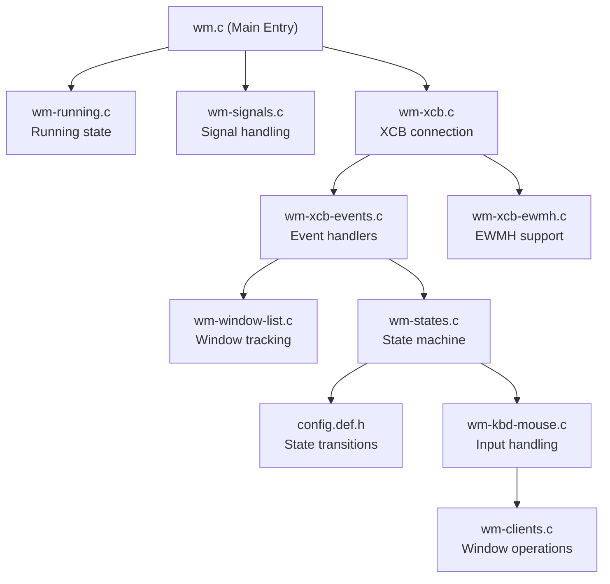

Sources: [wm.c:1-27](), [wm-xcb.c:1-144](), [wm-xcb-events.c:1-274](), [wm-window-list.c:1-16](), [wm-states.c:1-210]()

## Core Components

The window manager consists of the following core components:

| Component | File | Description |
|-----------|------|-------------|
| Main Entry | wm.c | Contains the main function and initialization sequence |
| XCB Connection | wm-xcb.c | Manages the connection to the X server |
| Event Handling | wm-xcb-events.c | Processes X events from the server |
| Window List | wm-window-list.c | Tracks and manages window properties |
| State Machine | wm-states.c | Handles state transitions based on user input |
| EWMH Support | wm-xcb-ewmh.c | Implements Extended Window Manager Hints |

Sources: [wm.c:1-27](), [wm-xcb.c:1-144](), [wm-xcb-events.c:1-274](), [wm-window-list.c:1-16](), [wm-states.c:1-210]()

## Initialization and Event Loop

The window manager follows a clear initialization sequence and operates within a central event loop:

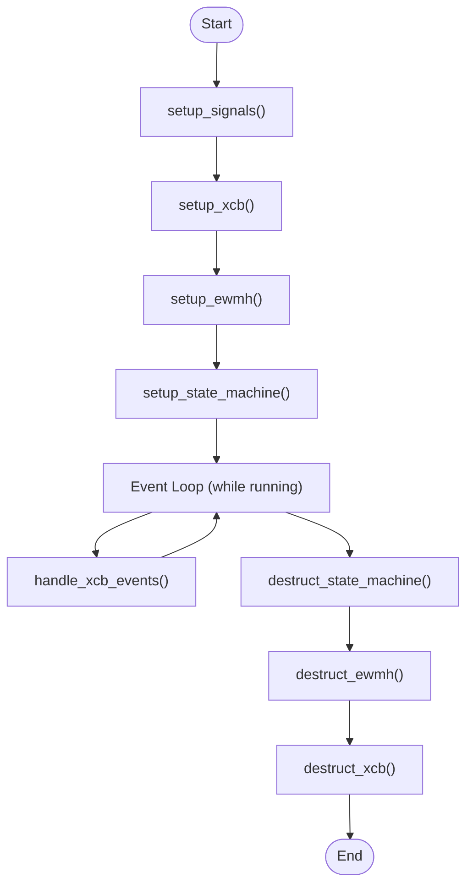

The initialization sequence in [wm.c:15-27]() consists of:

1. `setup_signals()` - Configures signal handlers
2. `setup_xcb()` - Establishes connection to X server and sets up initial window
3. `setup_ewmh()` - Initializes Extended Window Manager Hints support
4. `setup_state_machine()` - Prepares the state machine for handling user interactions

After initialization, the system enters the main event loop, calling `handle_xcb_events()` repeatedly until the `running` flag is set to false. Upon exit, appropriate cleanup occurs with `destruct_*` functions in reverse order of initialization.

Sources: [wm.c:15-27](), [wm-xcb.c:109-139]()

## Event Processing System

The event processing system is the core of the window manager, handling all events from the X server:

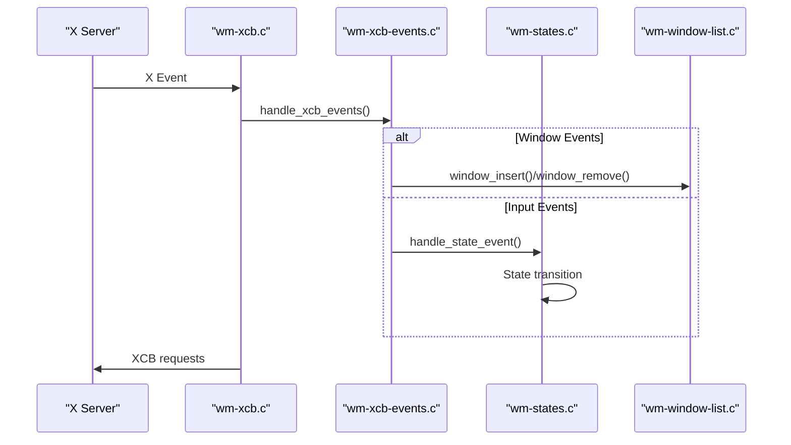

The event handling flow:

1. The X server sends events to the window manager
2. `handle_xcb_events()` in [wm-xcb.c:206-300]() receives the event
3. Based on the event type, the handler dispatches to appropriate functions
4. Window-related events update the window list
5. Input events (keyboard, mouse) are passed to the state machine
6. State changes may trigger window operations (move, resize, etc.)

Key event handlers include:
- `handle_key_press_release()` - Keyboard input
- `handle_button_press_release()` - Mouse button events
- `handle_motion_notify()` - Mouse movement
- `handle_create_notify()` - Window creation
- `handle_destroy_notify()` - Window destruction
- `handle_map_notify()` - Window mapping
- `handle_unmap_notify()` - Window unmapping

Sources: [wm-xcb.c:206-300](), [wm-xcb-events.c:1-274](), [wm-states.c:91-192]()

## Window Management System

Windows are tracked using a doubly-linked list implemented in [wm-window-list.c](). Each window is represented by a `wnd_node_t` structure:

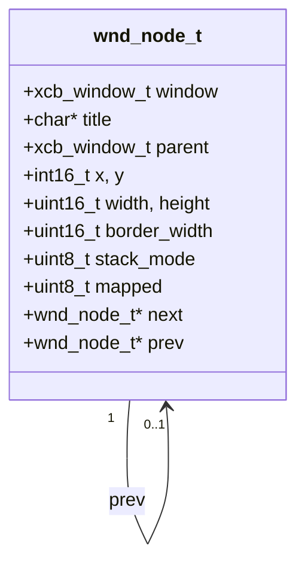

The window list uses a sentinel node pattern for efficient insertion and traversal. Key operations:

1. `window_insert(xcb_window_t window)` - Adds a window to the list
2. `window_remove(xcb_window_t window)` - Removes a window from the list
3. `window_find(xcb_window_t window)` - Locates a window in the list
4. `window_foreach(callback)` - Iterates through all windows

The system maintains a connection between the window list and X server events through:
- `handle_create_notify()` - Adds windows when created
- `handle_destroy_notify()` - Removes windows when destroyed
- `handle_map_notify()` - Updates window state when mapped
- `handle_unmap_notify()` - Updates window state when unmapped

Sources: [wm-window-list.c:1-116](), [wm-xcb-events.c:24-45](), [wm-xcb-events.c:219-235]()

## State Machine

User interactions are handled through a state machine defined in [wm-states.c]():

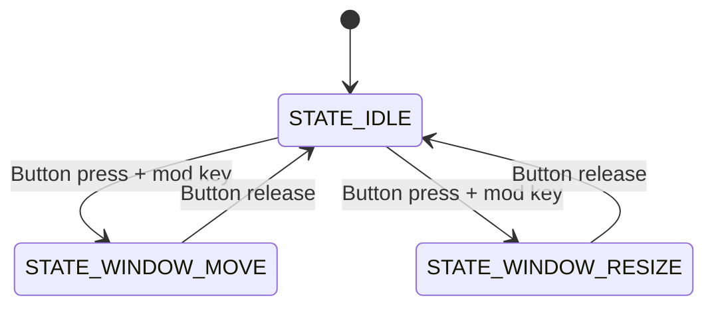

The state machine uses:

1. `Context` structure - Holds current state and event information
2. `StateTransition` - Defines conditions for state changes
3. State handler functions - Execute actions based on current state

The transitions between states are defined in the configuration file [config.def.h]() and are triggered by:
- Mouse button events (press/release)
- Keyboard events with modifiers
- Window target type (root/client window)

When an event occurs:
1. `handle_state_event()` updates the context with event information
2. The function identifies applicable state transitions
3. If a transition matches, it updates the state and calls the appropriate state handler

Sources: [wm-states.c:1-210]()

## X11 Interface Layer

The window manager's interface with the X Window System is managed through the XCB library:

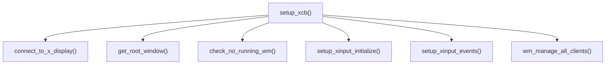

The X11 interface:

1. Establishes connection to the X server via `connect_to_x_display()`
2. Retrieves the root window with `get_root_window()`
3. Checks that no other window manager is running via `check_no_running_wm()`
4. Sets up XInput for advanced input handling
5. Configures event masks to receive relevant events
6. Discovers and manages existing client windows via `wm_manage_all_clients()`

The `handle_xcb_events()` function serves as the central point for receiving events from the X server and dispatching them to appropriate handlers.

Sources: [wm-xcb.c:32-204](), [wm-xcb.c:206-300]()

## Integration Between Components

The integration between the major components is facilitated through:

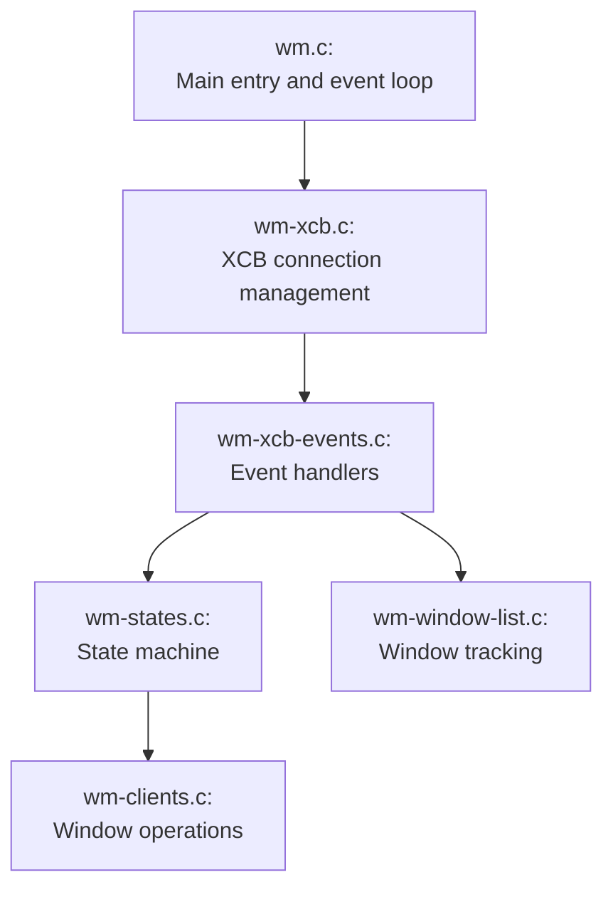

Key integration points:

1. **Event-to-State**: `handle_xcb_events()` calls `handle_state_event()` to process input events through the state machine
2. **Event-to-Window**: Event handlers call `window_insert()`, `window_remove()`, and other window list functions
3. **State-to-Window**: State handlers perform operations on windows based on user interactions
4. **XCB-to-X Server**: XCB requests are sent to the X server to affect changes in window properties

The system follows a modular design where each component has clear responsibilities and communicates with others through well-defined interfaces.

Sources: [wm.c:1-27](), [wm-xcb.c:206-300](), [wm-xcb-events.c:1-274](), [wm-states.c:91-192](), [wm-window-list.c:48-86]()
# Building and Running

<details>
<summary>Relevant source files</summary>

The following files were used as context for generating this wiki page:

- [.editorconfig](.editorconfig)
- [Dockerfile](Dockerfile)
- [Makefile](Makefile)

</details>


## Purpose and Scope
This document provides instructions for building the wm-xcb window manager from source and running it in various environments. It covers required dependencies, build configuration options, and execution methods. For information about the architecture and design, see [Architecture Overview](#1.1).

## Dependencies

The wm-xcb window manager requires several libraries to build and run properly:

| Dependency | Purpose |
|------------|---------|
| xcb | Core X C Binding library |
| xcb-atom | XCB Atom handling |
| xcb-ewmh | Extended Window Manager Hints support |
| xcb-xinput | X Input handling |
| libxcb-errors | XCB error handling |
| gcc | C compiler |
| pkg-config | Build dependency detection |
| make | Build automation |

Sources: [Makefile:8-12]()

### Installing Dependencies

On Debian/Ubuntu systems:
```
apt-get install libxcb1-dev libxcb-util-dev libxcb-ewmh-dev libxcb-xinput-dev gcc pkg-config make
```

For libxcb-errors, you may need to compile it from source as it's included as a vendored dependency in the `vendor/libxcb-errors` directory.

## Build Configuration

The build process can be configured using several variables defined in the Makefile:

| Variable | Default | Purpose |
|----------|---------|---------|
| `NAME` | wm | Executable name |
| `VERSION` | 0.0.1 | Version string |
| `DEBUG` | 0 | Debug mode flag |

Sources: [Makefile:1-4]()

### Debug Mode

Setting `DEBUG=1` enables:
- Compiler debugging flags (`-g3 -pedantic -Wall -O0`)
- Debug symbols in the linker (`-g`)
- Debug-specific code via the `DEBUG` preprocessor definition

When disabled, optimization flags are used instead (`-Os -flto`).

Sources: [Makefile:14-20]()

## Building the Window Manager

### Standard Build

To build the window manager with default options:

```
make
```

This compiles all source files and creates the `wm` executable.

Sources: [Makefile:41-47]()

### Debug Build

For development and debugging:

```
make DEBUG=1
```

Sources: [Makefile:14-20]()

### Cleaning the Build

To remove all build artifacts:

```
make clean
```

This removes the executable, object files, and test binaries.

Sources: [Makefile:53-54]()

### Source Components

The window manager consists of the following source components:

| Component | File | Description |
|-----------|------|-------------|
| Main entry point | wm.c | Program initialization and main loop |
| Logging | wm-log.c | Debugging and error reporting |
| Signal handling | wm-signals.c | System signal processing |
| Running state | wm-running.c | Global execution state |
| Window list | wm-window-list.c | Managed window tracking |
| Client operations | wm-clients.c | Window manipulation functions |
| EWMH support | wm-xcb-ewmh.c | Extended Window Manager Hints |
| Event handling | wm-xcb-events.c | X event processing |
| State machine | wm-states.c | Window manager state transitions |
| XCB connection | wm-xcb.c | X server communication |

Sources: [Makefile:22-32]()

## Testing

To build and run the test suite:

```
make test
```

This compiles the test files, links them with the window manager components, and executes the resulting test binary.

Sources: [Makefile:49-51]()

### Test Components

| Test | File | Description |
|------|------|-------------|
| Window list | test-wm-window-list.c | Tests window list operations |

Sources: [Makefile:36-37]()

## Running the Window Manager

### Direct Execution

After building, run the window manager:

```
./wm
```

### Docker Environment

The project includes Docker support for running in a controlled environment with X11VNC for visual testing.

#### Building Docker Image

```
make container-build
```

Sources: [Makefile:62-63](), [Dockerfile:1-22]()

#### Starting Container

```
make container-start
```

This starts a container with the current directory mounted at `/workspace` and X11VNC exposed on port 5900.

Sources: [Makefile:56-57]()

#### Accessing Container Shell

```
make container-exec
```

This opens an interactive bash shell in the running container.

Sources: [Makefile:59-60]()

#### Connecting to X11VNC

Connect a VNC client to `localhost:5900` with password "secret".

Sources: [Dockerfile:14-15]()

## Build Process Diagram

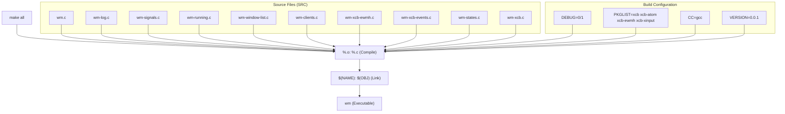

Sources: [Makefile:1-47]()

## Runtime Component Diagram

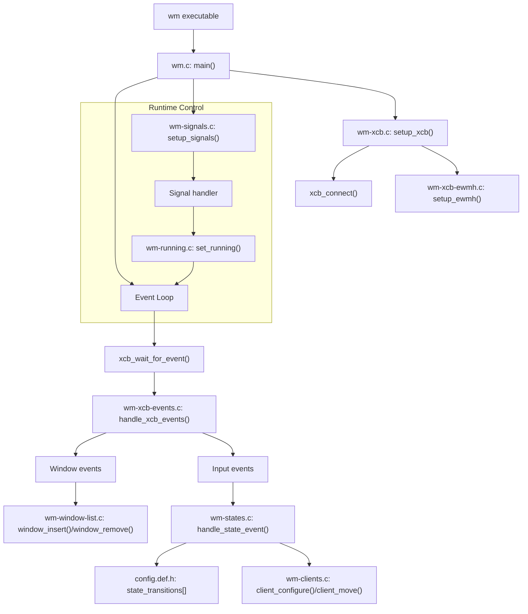

Sources: [Makefile:22-32]()", "# Key Concepts and Terminology

<details>
<summary>Relevant source files</summary>

The following files were used as context for generating this wiki page:

- [wm-states.h](wm-states.h)
- [wm-xcb-ewmh.h](wm-xcb-ewmh.h)
- [wm-xcb.c](wm-xcb.c)
- [wm-xcb.h](wm-xcb.h)
- [wm.c](wm.c)

</details>


This document explains the fundamental concepts and terminology used throughout the wm-xcb window manager. Understanding these core concepts is essential for developers working with or extending the window manager. For detailed information about the overall architecture, see [Architecture Overview](#1.1).

## X Window System and XCB

The wm-xcb window manager is built on top of the X Window System (commonly called X11), using the X C Binding (XCB) library for communication.

### X Window System

The X Window System is a network-transparent windowing system that provides a framework for building graphical user interfaces. It follows a client-server model:

- **X Server**: Manages displays, handles input (keyboard, mouse), and provides basic windowing mechanisms
- **X Clients**: Applications that connect to the X Server to display windows and receive input

### XCB (X C Binding)

XCB is a C library interface to the X Window System protocol, designed as a replacement for Xlib. Key characteristics include:

- Low-level interface that maps closely to the X protocol
- Asynchronous request/reply mechanisms
- Lighter weight than Xlib with smaller memory footprint
- Thread-friendly design

In wm-xcb, the connection to the X server is managed in [wm-xcb.c]() and is accessible through the global `dpy` variable.

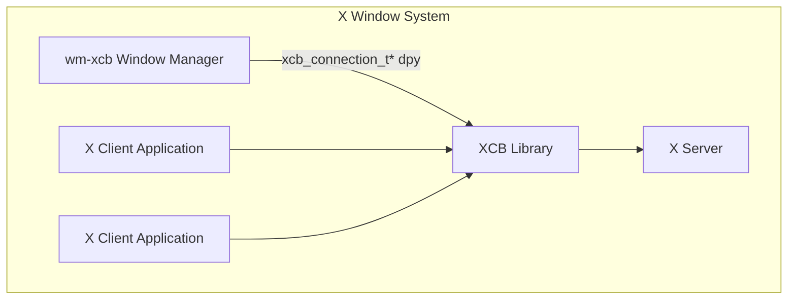

Sources: [wm-xcb.c:1-15](), [wm-xcb.c:32-47](), [wm-xcb.h:1-15]()

## Window Concepts

### Window Types

The window manager recognizes different types of windows, each serving specific purposes:

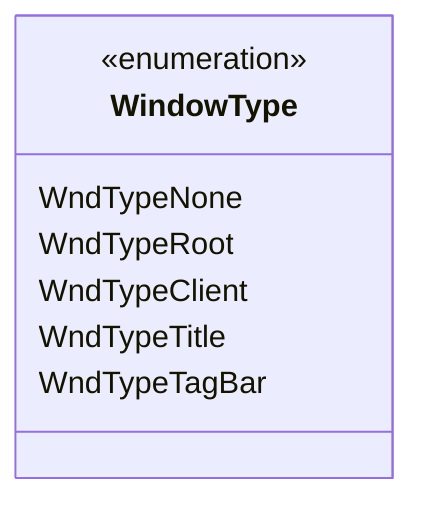

- **Root Window** (`WndTypeRoot`): The base window that covers the entire screen, owned by the X server
- **Client Window** (`WndTypeClient`): Application windows managed by the window manager
- **Title Window** (`WndTypeTitle`): Window decorations showing the title of a client window
- **Tag Bar** (`WndTypeTagBar`): UI element for workspace/tag management

Sources: [wm-states.h:9-16]()

### Window Hierarchy

X11 windows exist in a hierarchical tree structure:

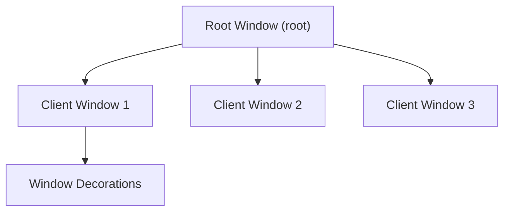

The window manager tracks this hierarchy and uses it for operations like:
- Finding the parent of a window
- Managing window stacking order
- Handling events propagation

Sources: [wm-xcb.c:146-204]()

## Events System

The X Window System is event-driven. Events flow from the X Server to client applications, including the window manager.

### Event Types

wm-xcb handles numerous event types, including:

- **Input Events**: Key presses/releases, button presses/releases, pointer motion
- **Window Management Events**: Window creation/destruction, mapping/unmapping, property changes
- **XInput Extension Events**: Advanced input device events (touch, raw input)

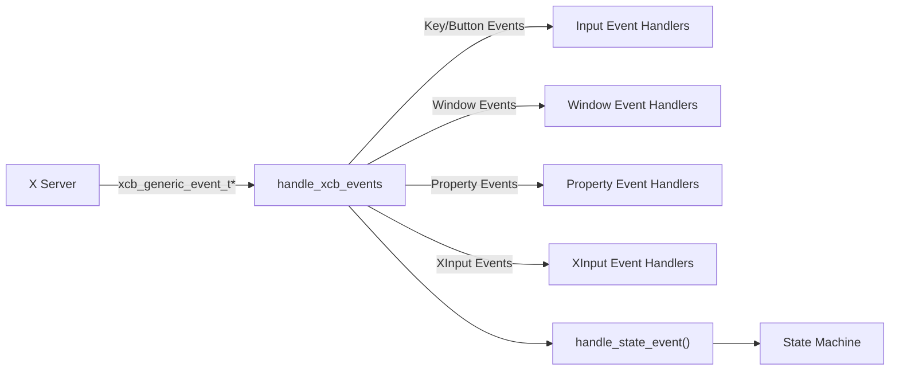

Sources: [wm-xcb.c:206-300](), [wm-states.h:34-40]()

### Event Handling Flow

1. The window manager waits for events from the X server using `xcb_poll_for_event()`
2. Events are dispatched to specific handlers based on their type
3. After type-specific handling, events are passed to the state machine via `handle_state_event()`
4. The state machine may trigger state transitions and window operations

Sources: [wm-xcb.c:206-300]()

## State Machine

wm-xcb uses a state machine to manage its behavior in response to user input.

### States

The window manager operates in one of several states:

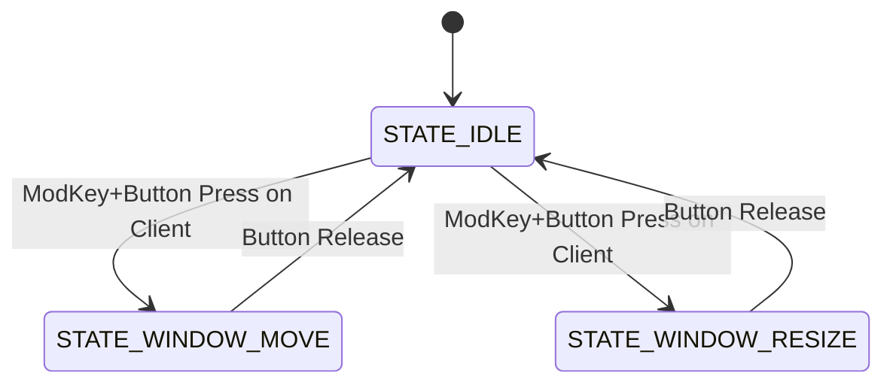

- **STATE_IDLE**: Default state, waiting for input
- **STATE_WINDOW_MOVE**: Moving a window with the mouse
- **STATE_WINDOW_RESIZE**: Resizing a window with the mouse

Sources: [wm-states.h:42-46]()

### State Transitions

State transitions are triggered by events matching specific criteria:

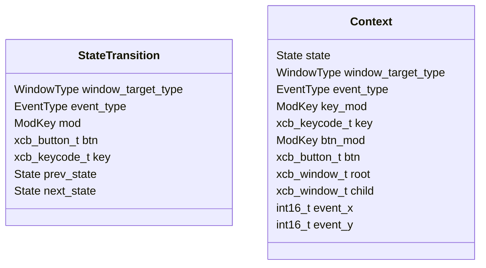

Each transition depends on:
- Current state
- Window type being interacted with
- Event type (key press/release, button press/release)
- Modifier keys and buttons involved

Sources: [wm-states.h:48-77]()

## Input Handling

### Modifier Keys

The window manager recognizes various modifier keys to trigger different actions:

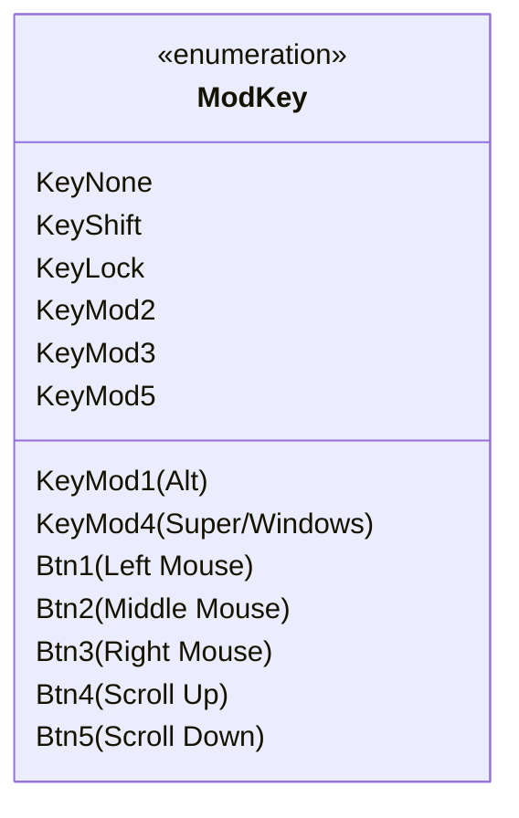

These modifiers can be combined (using bitwise OR) to create complex key combinations.

Sources: [wm-states.h:18-32]()

### XInput Extension

wm-xcb utilizes the XInput extension for advanced input device handling:

- Supports multiple input devices
- Handles advanced input types (touch, raw input)
- Provides device hierarchy and property change notifications

Sources: [wm-xcb.c:55-97]()

## EWMH Protocol

### Extended Window Manager Hints

EWMH (Extended Window Manager Hints) is a protocol that standardizes communication between window managers and client applications. It enables:

- Client applications to request specific window behaviors
- Communication about desktop/workspace information
- Standard ways to provide window decorations and controls

The window manager sets up EWMH support during initialization via `setup_ewmh()`.

```mermaid
flowchart TD
    WM["wm-xcb"] --> setup_ewmh["setup_ewmh()"]
    setup_ewmh --> EWMH["EWMH Protocol"]
    EWMH --> Applications["Client Applications"]
```

Sources: [wm-xcb-ewmh.h:1-9](), [wm.c:18]()

## Window Management Operations

The window manager performs several key operations:

### Window Discovery and Management

On startup, the window manager:
1. Queries all existing windows with `xcb_query_tree_unchecked()`
2. Identifies direct children of the root window
3. Takes control of these windows (reparenting under root)
4. Sets up event masks to receive relevant events

Sources: [wm-xcb.c:146-204]()

### Window Tracking

All managed windows are tracked in a data structure (window list):

```mermaid
flowchart TD
    handle_create_notify["handle_create_notify()"] --> window_insert
    handle_destroy_notify["handle_destroy_notify()"] --> window_remove

    subgraph "Window List"
        window_insert["window_insert()"]
        window_remove["window_remove()"]
    end
```

This tracking enables the window manager to:
- Keep track of window properties (position, size, state)
- Apply consistent policies across all windows
- Handle window-related events appropriately

Sources: [wm-xcb.c:131](), [wm-xcb.c:142](), [wm-xcb.c:240-241]()

## Initialization and Shutdown Flow

The window manager follows a specific sequence for initialization and shutdown:

```mermaid
sequenceDiagram
    participant Main as main()
    participant Signals as setup_signals()
    participant XCB as setup_xcb()
    participant EWMH as setup_ewmh()
    participant States as setup_state_machine()

    Main->>Signals: setup_signals()
    Main->>XCB: setup_xcb()
    XCB->>XCB: connect_to_x_display()
    XCB->>XCB: get_root_window()
    XCB->>XCB: check_no_running_wm()
    XCB->>XCB: setup_xinput_initialize()
    XCB->>XCB: setup_xinput_events()
    XCB->>XCB: wm_manage_all_clients()
    Main->>EWMH: setup_ewmh()
    Main->>States: setup_state_machine()

    Main->>Main: Event Loop

    Main->>States: destruct_state_machine()
    Main->>EWMH: destruct_ewmh()
    Main->>XCB: destruct_xcb()
```

Sources: [wm.c:15-27]()", "# Core Systems

<details>
<summary>Relevant source files</summary>

The following files were used as context for generating this wiki page:

- [wm-log.c](wm-log.c)
- [wm-log.h](wm-log.h)
- [wm-running.c](wm-running.c)
- [wm-signals.c](wm-signals.c)
- [wm.c](wm.c)

</details>


## Purpose and Scope

This document provides an overview of the core foundational systems that comprise the wm-xcb window manager. These systems handle initialization, signal management, state control, and logging. They serve as the backbone upon which the rest of the window manager functionality is built.

For details about the X11 interface layer, see [X11 Interface Layer](#3). For specifics on window management functionality, see [Window Management](#4).

## System Architecture Overview

The core systems consist of four primary components that work together to establish and maintain the window manager's execution environment:

```mermaid
flowchart TD
    subgraph "Core Systems"
        main["main()\nInitialization & main loop"] --> signals["Signal Handling\nsigint(), sigchld()"]
        main --> running["Running State\nrunning flag"]
        main --> logging["Logging System\nlogger(), LOG_* macros"]
        signals --> running
        logging --> running
    end

    main --> xcb["XCB Connection\n(X11 Interface Layer)"]
    main --> ewmh["EWMH Support"]
    main --> states["State Machine"]

    style main stroke-width:2px
    style signals stroke-width:1.5px
    style running stroke-width:1.5px
    style logging stroke-width:1.5px
```

Sources: [wm.c:15-27](), [wm-signals.c:11-36](), [wm-running.c:1-5](), [wm-log.c:8-21]()

## Main Entry Point

The main entry point of the window manager is contained in `wm.c`. It establishes a simple and straightforward flow:

```mermaid
flowchart TD
    start["main()"] --> setup_signals["setup_signals()"]
    setup_signals --> setup_xcb["setup_xcb()"]
    setup_xcb --> setup_ewmh["setup_ewmh()"]
    setup_ewmh --> setup_state_machine["setup_state_machine()"]
    setup_state_machine --> event_loop["while (running)\nhandle_xcb_events()"]
    event_loop --> cleanup["Cleanup\ndestruct_state_machine()\ndestruct_ewmh()\ndestruct_xcb()"]
    cleanup --> end["return 0"]
```

The main function initializes all required components, enters an event loop that continues as long as the `running` flag is set to a non-zero value, and then performs cleanup operations before exiting.

Sources: [wm.c:15-27]()

## Running State Management

The running state is maintained through a global atomic flag controlled by the signal handlers. This simple yet effective approach allows for graceful termination of the window manager.

```c
sig_atomic_t running = 1;
```

This flag is:
- Initialized to 1 to keep the main event loop running
- Set to 0 when a termination signal (SIGINT or SIGTERM) is received
- Referenced by the `LOG_FATAL` macro to trigger termination on fatal errors

Sources: [wm-running.c:1-5]()

## Signal Handling System

The signal handling system manages external signals that control the window manager's lifecycle:

```mermaid
flowchart TD
    setup_signals["setup_signals()"] --> register_sigint["Register SIGINT handler"]
    setup_signals --> register_sigterm["Register SIGTERM handler"]

    register_sigint --> sigint["sigint()\nset running = 0"]
    register_sigterm --> sigint

    setup_signals -.-> register_sigchld["Register SIGCHLD handler"]
    register_sigchld -.-> sigchld["sigchld()\nwaitpid() to reap\nchild processes"]

    sigint --> exit["Exit main loop"]
```

The signal handling system:
- Catches SIGINT and SIGTERM signals to gracefully shut down the window manager
- Handles SIGCHLD signals to prevent zombie processes by reaping terminated child processes
- Sets the global `running` flag to 0 when termination is requested

Sources: [wm-signals.c:11-36]()

## Logging System

The logging system provides structured message output with different severity levels. It's designed to be compact and efficient while providing useful information for debugging and monitoring.

```mermaid
classDiagram
    class logger {
        +logger(FILE* io, const char* fmt, ...)
        Formats and outputs messages
        Adds newline or error message
    }

    class LoggingMacros {
        +LOG_DEBUG(format, ...) // Only in DEBUG builds
        +LOG_ERROR(format, ...)
        +LOG_FATAL(format, ...) // Also sets running=0
        +LOG_CLEAN(format, ...) // No prefix
    }

    logger <-- LoggingMacros : uses
```

### Logging Levels

| Macro | Purpose | Output Stream | Behavior |
|-------|---------|--------------|----------|
| `LOG_DEBUG` | Development debugging | stdout | Only active when DEBUG is defined |
| `LOG_ERROR` | Error reporting | stderr | Prefixes with "ERROR: " |
| `LOG_FATAL` | Critical errors | stderr | Prefixes with "FATAL: " and sets running=0 |
| `LOG_CLEAN` | Clean output | stdout | No prefix, just the message |

The logger function itself handles formatting variadic arguments, automatic newline insertion, and proper error message reporting when the format string ends with a colon.

Sources: [wm-log.h:9-21](), [wm-log.c:8-21]()

## Initialization and Shutdown Flow

The core systems follow a clear initialization and shutdown sequence:

```mermaid
sequenceDiagram
    participant Main as main()
    participant Signals as Signal System
    participant XCB as XCB Connection
    participant EWMH as EWMH Support
    participant States as State Machine
    participant EventLoop as Event Loop

    Main->>Signals: setup_signals()
    Main->>XCB: setup_xcb()
    Main->>EWMH: setup_ewmh()
    Main->>States: setup_state_machine()

    Main->>EventLoop: while (running)
    loop Event Loop
        EventLoop->>XCB: handle_xcb_events()
        Note over Signals, EventLoop: Signal can set running=0
    end

    Main->>States: destruct_state_machine()
    Main->>EWMH: destruct_ewmh()
    Main->>XCB: destruct_xcb()
```

This sequence ensures that all resources are properly initialized before use and cleanly released upon termination. The symmetrical setup/destruct calls maintain resource integrity and prevent memory leaks.

Sources: [wm.c:15-27]()

## System Integration

The core systems serve as the foundation for the entire window manager, providing essential services to the higher-level components:

```mermaid
flowchart TD
    subgraph "Core Systems"
        main["main() Entry Point"]
        signals["Signal Handling"]
        running["Running State"]
        logging["Logging System"]
    end

    subgraph "X11 Interface Layer"
        xcb["XCB Connection"]
        ewmh["EWMH Support"]
        events["Event Handling"]
    end

    subgraph "Window Management"
        window_list["Window List"]
        clients["Client Operations"]
    end

    subgraph "Input Handling"
        state_machine["State Machine"]
        kbd_mouse["Keyboard & Mouse Input"]
    end

    main --> xcb
    main --> ewmh
    main --> state_machine
    signals --> running
    running --> main
    logging --> main
    logging --> xcb
    logging --> ewmh
    logging --> state_machine

    xcb --> events
    events --> window_list
    events --> state_machine
    state_machine --> clients
```

Sources: [wm.c:15-27](), [wm-signals.c:11-36](), [wm-running.c:1-5](), [wm-log.h:9-21]()

## Summary

The core systems of wm-xcb provide:

1. A well-structured entry point and initialization sequence
2. Robust signal handling for graceful termination
3. A simple but effective running state mechanism
4. A flexible logging system for different verbosity levels

These foundations enable the more complex functionality found in the other components of the window manager, providing a stable base for window management operations.", "# Main Entry Point and Event Loop

<details>
<summary>Relevant source files</summary>

The following files were used as context for generating this wiki page:

- [wm-running.h](wm-running.h)
- [wm.c](wm.c)

</details>


This page documents the main entry point and event loop of the wm-xcb window manager. It focuses on the system startup sequence, the core event loop that powers the window manager, and the shutdown process. For information about signal handling that affects the event loop, see [Signal Handling and Running State](#2.2).

## Overview

The main entry point and event loop serve as the central coordinating mechanism for the entire window manager. The system follows a standard pattern for X11 window managers:

1. Initialize required components
2. Enter a loop that processes X events
3. Clean up resources when the loop exits

This architecture creates a responsive system that reacts to user input and X server events in real-time.

Sources: [wm.c:15-27]()

## Initialization Sequence

The main function in `wm.c` performs a series of initialization steps before entering the event loop:

```mermaid
flowchart TD
    Start["main()"] --> SetupSignals["setup_signals()"]
    SetupSignals --> SetupXCB["setup_xcb()"]
    SetupXCB --> SetupEWMH["setup_ewmh()"]
    SetupEWMH --> SetupStateMachine["setup_state_machine()"]
    SetupStateMachine --> EventLoop["Event Loop"]

    style Start fill:#f5f5f5,stroke:#333,stroke-width:2px
    style EventLoop fill:#f5f5f5,stroke:#333,stroke-width:2px
```

The initialization sequence establishes all necessary components for the window manager to function:

1. **Signal Handling Setup**: Configures signal handlers for system signals like SIGINT and SIGTERM
2. **XCB Connection Setup**: Establishes connection to the X server via XCB
3. **EWMH Setup**: Initializes Extended Window Manager Hints support
4. **State Machine Setup**: Sets up the state machine that manages window operations

Sources: [wm.c:15-19]()

## Event Loop Structure

The event loop is the heart of the window manager, continuously processing events from the X server until the `running` flag is set to false:

```c
while (running) {
    handle_xcb_events();
}
```

The `running` variable is declared as a `sig_atomic_t` to ensure atomic access when modified by signal handlers. This provides a clean way to exit the event loop when a signal like SIGINT is received.

```mermaid
flowchart TD
    Start["Start Event Loop"] --> CheckRunning{"running == true?"}
    CheckRunning -->|Yes| HandleEvents["handle_xcb_events()"]
    HandleEvents --> CheckRunning
    CheckRunning -->|No| Exit["Exit Loop"]

    SignalHandler["Signal Handler"] -.->|"sets running = 0"| Running["running variable"]
    Running -.-> CheckRunning
```

The `handle_xcb_events()` function processes all pending events from the X server, dispatching them to appropriate handler functions based on the event type.

Sources: [wm.c:20-22](), [wm-running.h:7]()

## Event Processing Flow

When the event loop calls `handle_xcb_events()`, a complex event handling chain is triggered:

```mermaid
sequenceDiagram
    participant Main as "Main Loop"
    participant XCB as "handle_xcb_events()"
    participant EventHandler as "Event Type Handlers"
    participant WindowManager as "Window Management"
    participant StateManager as "State Machine"

    Main->>XCB: Call handle_xcb_events()
    XCB->>XCB: Poll for XCB events

    loop For each event
        XCB->>EventHandler: Dispatch based on event type

        alt MapRequest/UnmapNotify
            EventHandler->>WindowManager: Update window tracking
        else ButtonPress/KeyPress
            EventHandler->>StateManager: Trigger state transition
            StateManager->>WindowManager: Perform window operations
        else PropertyNotify
            EventHandler->>WindowManager: Update window properties
        end
    end

    XCB->>Main: Return to main loop
```

This event processing architecture allows the window manager to respond to a variety of X server events, from window creation and destruction to user input events like keyboard and mouse actions.

Sources: [wm.c:21]()

## Shutdown Sequence

When the `running` flag is set to false (typically by a signal handler), the event loop exits and the main function performs cleanup operations in reverse order of initialization:

```mermaid
flowchart TD
    EventLoop["Event Loop Exit"] --> DestructStateMachine["destruct_state_machine()"]
    DestructStateMachine --> DestructEWMH["destruct_ewmh()"]
    DestructEWMH --> DestructXCB["destruct_xcb()"]
    DestructXCB --> Exit["Program Exit"]

    style EventLoop fill:#f5f5f5,stroke:#333,stroke-width:2px
    style Exit fill:#f5f5f5,stroke:#333,stroke-width:2px
```

This orderly shutdown ensures that all resources are properly released:

1. **State Machine Cleanup**: Releases resources allocated by the state machine
2. **EWMH Cleanup**: Cleans up EWMH-related resources
3. **XCB Cleanup**: Closes the connection to the X server

Sources: [wm.c:23-26]()

## Component Interaction

The main entry point and event loop interact with multiple subsystems of the window manager. This diagram shows how data flows between these components during the window manager's operation:

```mermaid
graph TD
    Main["main() - wm.c"] --> Running["running - wm-running.h"]
    Main --> SignalHandlers["setup_signals() - wm-signals.c"]
    Main --> XCBSetup["setup_xcb() - wm-xcb.c"]
    Main --> EWMHSetup["setup_ewmh() - wm-xcb-ewmh.c"]
    Main --> StateMachineSetup["setup_state_machine() - wm-states.c"]

    Main --> EventLoop["Event Loop"]
    EventLoop --> XCBEvents["handle_xcb_events() - wm-xcb-events.c"]

    XCBEvents --> WindowList["Window List - wm-window-list.c"]
    XCBEvents --> StateMachine["State Machine - wm-states.c"]

    SignalHandlers -.->|"Modifies"| Running
    Running -.->|"Controls"| EventLoop
```

This structure demonstrates how the main function and event loop act as the coordinating center for all window manager functionality, from initial setup to event handling and shutdown.

Sources: [wm.c:15-27]()

## Summary

The main entry point and event loop form the central backbone of the wm-xcb window manager. The system follows a clear sequence of:

1. **Initialization**: Setting up signal handlers, XCB connection, EWMH support, and the state machine
2. **Event Loop**: Continuously processing X events until termination is requested
3. **Shutdown**: Cleaning up resources in reverse order of initialization

This architecture provides a responsive window manager that efficiently handles X server events while maintaining clean resource management.

Sources: [wm.c:15-27](), [wm-running.h:7]()", "# Signal Handling and Running State

<details>
<summary>Relevant source files</summary>

The following files were used as context for generating this wiki page:

- [wm-clients.c](wm-clients.c)
- [wm-log.c](wm-log.c)
- [wm-running.c](wm-running.c)
- [wm-running.h](wm-running.h)
- [wm-signals.c](wm-signals.c)
- [wm-signals.h](wm-signals.h)

</details>


## Purpose and Scope

This document describes the signal handling system and running state management in the wm-xcb window manager. It explains how the window manager manages its execution state through the `running` variable and responds to various system signals like SIGINT, SIGTERM, and SIGCHLD. For information about the main event loop that uses this running state, see [Main Entry Point and Event Loop](#2.1).

## Running State Overview

The window manager uses a global `running` flag to control its execution lifecycle. This flag is implemented as a `sig_atomic_t` type, which guarantees atomic access and modification, making it suitable for use in signal handlers.

```mermaid
flowchart TD
    Start([Window Manager Start]) --> Initialize["Initialize running = 1"]
    Initialize --> EventLoop["Main Event Loop\n(while running == 1)"]
    EventLoop -->|"Signal received\n(SIGINT/SIGTERM)"| SetRunningToZero["Set running = 0"]
    SetRunningToZero --> ExitLoop["Exit Event Loop"]
    ExitLoop --> Cleanup["Cleanup Resources"]
    Cleanup --> End([Window Manager Exit])
```

Sources: [wm-running.h:1-10](), [wm-running.c:1-6]()

### Running Variable Implementation

The `running` variable is declared as a global `sig_atomic_t` in `wm-running.h` and initialized to `1` in `wm-running.c`. Using `sig_atomic_t` ensures that changes to the variable are atomic operations, preventing race conditions when the variable is accessed by signal handlers.

```
sig_atomic_t running = 1;
```

When `running` is set to `0`, it signals to the main event loop that it should terminate, leading to a graceful shutdown of the window manager.

Sources: [wm-running.h:7](), [wm-running.c:5]()

## Signal Handling System

The window manager handles three types of signals:

1. **SIGINT** - Interrupt signal (typically sent by pressing Ctrl+C)
2. **SIGTERM** - Termination signal (typically sent by system shutdown or `kill` command)
3. **SIGCHLD** - Child process termination signal

```mermaid
classDiagram
    class SignalSystem {
        +setup_signals()
        +sigint(int unused)
        +sigchld(int unused)
    }

    class RunningState {
        +sig_atomic_t running
    }

    SignalSystem --> RunningState : modifies
```

Sources: [wm-signals.h:1-9](), [wm-signals.c:1-37]()

### Signal Handler Setup

The `setup_signals()` function registers the appropriate signal handlers during the window manager's initialization:

```mermaid
sequenceDiagram
    participant Main as "Main Process"
    participant OS as "Operating System"

    Main->>OS: signal(SIGINT, sigint)
    Main->>OS: signal(SIGTERM, sigint)
    Note over Main,OS: Both SIGINT and SIGTERM use the same handler
```

The function installs handlers for SIGINT and SIGTERM, both mapped to the `sigint` function. If either handler cannot be installed, the application logs a fatal error and terminates.

Sources: [wm-signals.c:30-36]()

### Interrupt Signal Handling

When SIGINT or SIGTERM signals are received, the window manager executes the `sigint` function:

```mermaid
flowchart LR
    Signal["SIGINT/SIGTERM"] --> Handler["sigint() handler"]
    Handler --> SetRunning["Set running = 0"]
    Handler --> LogMessage["Log debug message"]
```

The handler performs the following actions:
1. Sets the `running` flag to `0`
2. Prints a newline for clean terminal output
3. Logs a debug message indicating receipt of the interrupt signal

Sources: [wm-signals.c:17-28]()

### Child Process Handling

The `sigchld` handler is responsible for preventing zombie processes by reaping terminated child processes:

```mermaid
flowchart LR
    Signal["SIGCHLD"] --> ReinstallHandler["Reinstall SIGCHLD handler"]
    ReinstallHandler --> ReapChildren["Reap child processes\nwaitpid(-1, NULL, WNOHANG)"]
```

The handler first reinstalls itself to ensure future SIGCHLD signals are caught, then calls `waitpid()` in a loop to collect the exit status of all terminated child processes.

Sources: [wm-signals.c:11-15]()

## Integration with Window Manager Lifecycle

The signal handling and running state system integrates with the window manager's lifecycle to ensure proper operation and graceful shutdown.

```mermaid
sequenceDiagram
    participant User
    participant OS as "Operating System"
    participant WM as "Window Manager"
    participant EventLoop as "Event Loop"

    WM->>WM: Initialize running = 1
    WM->>OS: setup_signals()
    WM->>EventLoop: Start (while running == 1)

    loop Event Processing
        EventLoop->>EventLoop: Process X events
    end

    User->>OS: Send SIGINT/SIGTERM
    OS->>WM: Deliver signal
    WM->>WM: sigint() sets running = 0

    EventLoop->>EventLoop: Check running flag
    EventLoop->>WM: Exit loop
    WM->>WM: Cleanup resources
    WM->>OS: Exit
```

### Commented Signal Code Blocks

The `sigint` function contains commented code (lines 23-27) that appears to be an alternative method to unblock the XCB event loop when it's waiting for events. This code would create and send a client message event to force the XCB event processing function to return, but it's not currently used.

```
/* when XCB is blocking-waitfor events, changing running to 0 doesn't exit. */
// xcb_generic_event_t event;
// event.response_type = XCB_CLIENT_MESSAGE;
// xcb_send_event(dpy, false, root, XCB_EVENT_MASK_NO_EVENT, (char*)&event);
// xcb_flush(dpy);
```

This commented code suggests that under certain conditions, merely setting the `running` flag to 0 might not be sufficient to exit the event loop if XCB is blocked waiting for events. However, the current implementation relies on the assumption that the event loop will eventually check the `running` flag.

Sources: [wm-signals.c:23-27]()

## Summary

The signal handling and running state management in wm-xcb provides a simple but effective mechanism for controlling the window manager's lifecycle:

1. The `running` variable acts as a global flag that controls the main event loop.
2. Signal handlers are installed for SIGINT, SIGTERM, and SIGCHLD.
3. The SIGINT/SIGTERM handler sets `running` to 0, triggering a graceful shutdown.
4. The SIGCHLD handler reaps terminated child processes to prevent zombies.

This system ensures that the window manager can respond appropriately to external signals and terminate cleanly when requested.

Sources: [wm-running.h:1-10](), [wm-running.c:1-6](), [wm-signals.h:1-9](), [wm-signals.c:1-37]()", "# Logging System

<details>
<summary>Relevant source files</summary>

The following files were used as context for generating this wiki page:

- [wm-log.h](wm-log.h)

</details>


The wm-xcb window manager implements a simple yet effective logging system that provides essential debugging, error reporting, and information output capabilities. This document describes the logging infrastructure, its components, and how it's used throughout the window manager codebase.

## Overview

The logging system in wm-xcb is designed to be lightweight and straightforward, providing different severity levels for messages without adding significant overhead. The system outputs messages to either stdout or stderr depending on the log level, and includes built-in mechanisms to terminate the application when fatal errors occur.

The logging functionality is primarily defined in a single header file that provides a core logging function and several convenience macros.

Sources: [wm-log.h:1-22]()

## Architecture

The logging system consists of a central logger function and a set of macros that represent different log levels. These components work together to provide consistent log formatting and behavior across the application.

```mermaid
graph TD
    A["Application Code"] --> B["LOG_DEBUG"]
    A --> C["LOG_ERROR"]
    A --> D["LOG_FATAL"]
    A --> E["LOG_CLEAN"]

    B -->|"Only in DEBUG mode"| F["logger()"]
    C --> F
    D --> F
    E --> F

    F -->|"Debug/Info/Clean messages"| G["stdout"]
    F -->|"Error/Fatal messages"| H["stderr"]

    D -->|"Sets running = 0"| I["Terminate application"]

    style A fill:white,stroke:black
    style B fill:white,stroke:black
    style C fill:white,stroke:black
    style D fill:white,stroke:black
    style E fill:white,stroke:black
    style F fill:white,stroke:black
    style G fill:white,stroke:black
    style H fill:white,stroke:black
    style I fill:white,stroke:black
```

The logger function provides the core functionality, while macros create a convenient interface with automatic message prefixing and additional behaviors like application termination for fatal errors.

Sources: [wm-log.h:9-20]()

## Core Components

### Logger Function

The logging system's foundation is the `logger` function:

```c
void logger(FILE* io, const char* fmt, ...);
```

This function takes:
- A file pointer (`io`) that determines where output is directed (stdout or stderr)
- A format string (`fmt`) similar to printf
- Variable arguments for the format string

The implementation is not visible in the provided header, but the function signature indicates it follows the standard variadic function pattern for formatting and output.

Sources: [wm-log.h:9]()

### Log Level Macros

The system defines four main logging macros:

| Macro | Description | Output Stream | Prefix | Special Behavior |
|-------|-------------|--------------|--------|------------------|
| `LOG_DEBUG` | Debug information (conditional) | stdout | "DEBUG: " | Only active when DEBUG is defined |
| `LOG_ERROR` | Error messages | stderr | "ERROR: " | - |
| `LOG_FATAL` | Fatal error messages | stderr | "FATAL: " | Sets `running = 0` to terminate the application |
| `LOG_CLEAN` | Clean output without prefix | stdout | none | For user-facing or formatted output |

These macros provide a convenient interface to the logger function with consistent prefixing and appropriate output streams.

Sources: [wm-log.h:11-20]()

## Log Levels and Usage

```mermaid
flowchart TD
    A["Logging Event"] --> B{"What type of\nmessage?"}
    B -->|"Debug/Diagnostic info"| C{"DEBUG\ndefined?"}
    C -->|"Yes"| D["LOG_DEBUG()"]
    C -->|"No"| E["Message discarded"]

    B -->|"Non-fatal error"| F["LOG_ERROR()"]

    B -->|"Fatal error"| G["LOG_FATAL()"]
    G --> H["Sets running = 0"]
    H --> I["Application terminates"]

    B -->|"User output\n(no prefix)"| J["LOG_CLEAN()"]

    D --> K["Message to stdout"]
    F --> L["Message to stderr"]
    G --> L
    J --> K

    style A fill:white,stroke:black
    style B fill:white,stroke:black
    style C fill:white,stroke:black
    style D fill:white,stroke:black
    style E fill:white,stroke:black
    style F fill:white,stroke:black
    style G fill:white,stroke:black
    style H fill:white,stroke:black
    style I fill:white,stroke:black
    style J fill:white,stroke:black
    style K fill:white,stroke:black
    style L fill:white,stroke:black
```

### LOG_DEBUG

Debug messages provide diagnostic information that is useful during development and troubleshooting. These messages are only compiled into the binary when the `DEBUG` preprocessor symbol is defined, ensuring they don't impact performance in production builds.

Example usage:
```c
LOG_DEBUG("Processing window %d with dimensions %dx%d", window_id, width, height);
```

Sources: [wm-log.h:11-15]()

### LOG_ERROR

Error messages indicate a problem that doesn't require immediate termination of the application. They're always compiled into the binary and output to stderr.

Example usage:
```c
LOG_ERROR("Failed to configure window %d: %s", window_id, error_message);
```

Sources: [wm-log.h:17]()

### LOG_FATAL

Fatal error messages indicate a critical problem that prevents the application from continuing. This macro not only logs the message to stderr but also sets the global `running` variable to 0, triggering a graceful shutdown of the window manager.

Example usage:
```c
LOG_FATAL("Could not connect to X server: %s", error_message);
```

Sources: [wm-log.h:18]()

### LOG_CLEAN

The clean logging function outputs messages without any prefix, making it suitable for user-facing output or structured information that should be parsed by other tools.

Example usage:
```c
LOG_CLEAN("Window Manager Version %s", VERSION);
```

Sources: [wm-log.h:20]()

## Integration with Global State

The logging system integrates with the window manager's global state through the `running` variable, which is imported from `wm-running.h`. This integration allows the `LOG_FATAL` macro to trigger application termination by setting this variable to 0.

The sequence of events when a fatal error occurs is:

1. `LOG_FATAL` macro is called with an error message
2. Message is logged to stderr with a "FATAL: " prefix
3. Global `running` variable is set to 0
4. Main event loop detects that `running` is 0 and begins shutdown sequence
5. Window manager exits gracefully

Sources: [wm-log.h:7](), [wm-log.h:18]()

## Compilation Considerations

The logging system is designed with conditional compilation in mind. Debug logging can be enabled or disabled by defining or undefining the `DEBUG` preprocessor symbol, typically through compiler flags.

To enable debug logging, compile with:
```
make DEBUG=1
```

This flexibility allows for detailed logging during development while maintaining optimal performance in production environments by removing debug log statements from the compiled binary.

Sources: [wm-log.h:11-15]()

## Best Practices

When using the logging system in the window manager codebase, consider the following best practices:

1. Use `LOG_DEBUG` for temporary diagnostic information or verbose output that's only needed during development
2. Use `LOG_ERROR` for recoverable errors that don't prevent the window manager from continuing
3. Use `LOG_FATAL` sparingly, only for truly unrecoverable situations
4. Use `LOG_CLEAN` for output that may be read by users or parsed by other tools
5. Include relevant context in log messages, such as window IDs, coordinates, or error codes
6. Format log messages consistently to make them easier to search and analyze

## Summary

The wm-xcb logging system provides a simple but effective way to report different types of information, from debugging details to fatal errors. Its integration with the window manager's global state allows for graceful termination when necessary, while conditional compilation ensures optimal performance in production environments.

The system's straightforward design makes it easy to use throughout the codebase, providing consistent log formatting and appropriate output streams for different message types.", "# X11 Interface Layer

<details>
<summary>Relevant source files</summary>

The following files were used as context for generating this wiki page:

- [wm-xcb-ewmh.c](wm-xcb-ewmh.c)
- [wm-xcb-ewmh.h](wm-xcb-ewmh.h)
- [wm-xcb.c](wm-xcb.c)
- [wm-xcb.h](wm-xcb.h)

</details>


## Purpose and Scope

The X11 Interface Layer forms the foundational connection between the window manager and the X Window System. This layer is responsible for establishing and maintaining the XCB connection, handling X events, and implementing extended protocols like EWMH. This document explains the core components, initialization process, and event handling mechanisms that enable the window manager to interact with the X Server.

For details about specific event handling implementations, see [XCB Event Handling](#3.3). For window management operations, see [Window Management](#4).

Sources: [wm-xcb.h:1-14](), [wm-xcb-ewmh.h:1-8]()

## X11 Interface Layer Architecture

```mermaid
graph TD
    subgraph "X11 Interface Layer"
        xcb["wm-xcb.c\nXCB Connection Management"]
        ewmh["wm-xcb-ewmh.c\nEWMH Support"]
    end

    main["wm.c\nMain Entry Point"] --> xcb
    xcb --> ewmh
    xcb --> events["wm-xcb-events.c\nEvent Handling"]
    events --> states["wm-states.c\nState Machine"]
    events --> window_list["wm-window-list.c\nWindow Tracking"]

    xcb -.-> X["X Server"]
    ewmh -.-> X
```

This diagram shows how the X11 Interface Layer connects the window manager to the X Server. The layer consists of XCB connection management (`wm-xcb.c`) and EWMH support (`wm-xcb-ewmh.c`), which together enable communication with the X Server.

Sources: [wm-xcb.c:1-11](), [wm-xcb-ewmh.c:1-10]()

## XCB Connection Management

The connection to the X Server is managed through the XCB (X C Binding) library, which provides a lightweight, direct interface to the X11 protocol. The window manager establishes this connection during initialization and uses it for all subsequent interactions with the X Server.

### Key Components

- Global XCB connection: `dpy` - The main connection to the X Server
- Root window: `root` - The top-level window that contains all other windows

### Initialization Sequence

```mermaid
sequenceDiagram
    participant Main as "wm.c (Main)"
    participant XCB as "wm-xcb.c"
    participant WindowList as "wm-window-list.c"
    participant XInput as "XInput"
    participant XServer as "X Server"

    Main->>XCB: setup_xcb()
    XCB->>XServer: xcb_connect()
    XServer-->>XCB: connection established
    XCB->>XServer: get_root_window()
    XServer-->>XCB: root window information

    XCB->>WindowList: setup_window_list()

    XCB->>XServer: check_no_running_wm()
    Note over XCB,XServer: Checks if another WM is running by trying to subscribe to substructure redirect events

    XCB->>XInput: setup_xinput_initialize()
    XCB->>XInput: setup_xinput_events()

    XCB->>XServer: Set event mask on root window
    XCB->>XServer: Map root window
    XCB->>WindowList: window_insert(root)

    XCB->>XCB: wm_manage_all_clients()
    XCB->>XServer: Flush pending requests
```

This diagram illustrates the initialization sequence of the X11 Interface Layer. It starts with establishing a connection to the X Server, getting the root window, setting up necessary data structures, and finally configuring event handling for both the root window and existing client windows.

Sources: [wm-xcb.c:109-139](), [wm-xcb.c:32-47](), [wm-xcb.c:49-53]()

### Error Handling

The X11 Interface Layer includes robust error handling to report and diagnose XCB errors, which is essential for debugging and stability. The `error_details` function extracts detailed information about XCB errors, including the major/minor opcodes, error name, and extension information.

Sources: [wm-xcb.c:17-30]()

## XInput Support

XInput is an extension to the X protocol that provides advanced input device handling capabilities. The window manager initializes XInput support and subscribes to various input-related events.

### XInput Initialization

The window manager queries the XInput version supported by the X Server and configures it to receive input events from all devices.

```mermaid
graph TD
    subgraph "XInput Setup"
        initialize["setup_xinput_initialize()\nQuery XInput version"]
        events["setup_xinput_events()\nSubscribe to input events"]
    end

    xcb["setup_xcb()"] --> initialize
    initialize --> events
    events --> mask["XInput Event Mask\nButton events\nKey events\nMotion events\nTouch events\nRaw events"]
```

This diagram shows the XInput initialization process, where the window manager first queries the XInput version and then subscribes to specific event types from input devices.

Sources: [wm-xcb.c:55-97]()

## EWMH Support

The Extended Window Manager Hints (EWMH) specification provides a standard way for window managers and applications to interact. This support is implemented in the `wm-xcb-ewmh.c` file.

### EWMH Initialization

```mermaid
sequenceDiagram
    participant Main as "wm.c (Main)"
    participant XCB as "wm-xcb.c"
    participant EWMH as "wm-xcb-ewmh.c"
    participant XServer as "X Server"

    Main->>XCB: setup_xcb()
    XCB->>EWMH: setup_ewmh()
    EWMH->>EWMH: Allocate EWMH connection
    EWMH->>XServer: xcb_ewmh_init_atoms()
    XServer-->>EWMH: EWMH atoms
    EWMH->>EWMH: xcb_ewmh_init_atoms_replies()
```

This diagram illustrates the initialization sequence for EWMH support. The window manager allocates an EWMH connection structure, initializes EWMH atoms, and processes the replies to set up EWMH support.

Sources: [wm-xcb-ewmh.c:13-21]()

### Atom Name Retrieval

The window manager can retrieve and print the names of X atoms, which is useful for debugging and understanding property notifications.

Sources: [wm-xcb-ewmh.c:27-38]()

## Event Handling

The X11 Interface Layer processes events from the X Server through the `handle_xcb_events` function. This function polls for events, determines their type, and dispatches them to the appropriate handler.

### Event Processing Flow

```mermaid
flowchart TD
    Start["handle_xcb_events()"] --> Poll["xcb_poll_for_event()"]
    Poll --> EventCheck["event != NULL?"]
    EventCheck -- "Yes" --> EventType["Check event->response_type"]
    EventCheck -- "No" --> End["Return"]

    EventType --> ErrorCase["Error (0)"]
    EventType --> KeyEvents["Key Events"]
    EventType --> ButtonEvents["Button Events"]
    EventType --> MotionEvents["Motion Events"]
    EventType --> WindowEvents["Window Events"]
    EventType --> PropertyEvents["Property Events"]
    EventType --> GenericEvents["Generic Events (XInput)"]

    ErrorCase --> ErrorDetails["error_details()\nLog error information"]

    KeyEvents --> KeyHandlers["handle_key_press_release()"]
    ButtonEvents --> ButtonHandlers["handle_button_press_release()"]
    MotionEvents --> MotionHandlers["handle_motion_notify()"]
    WindowEvents --> WindowHandlers["Various window event handlers"]
    PropertyEvents --> PropertyHandlers["handle_property_notify()"]
    GenericEvents --> GenericHandlers["handle_ge_generic()\nProcess XInput events"]

    KeyHandlers --> StateMachine["handle_state_event()\nProcess event in state machine"]
    ButtonHandlers --> StateMachine
    MotionHandlers --> StateMachine
    WindowHandlers --> StateMachine
    PropertyHandlers --> StateMachine
    GenericHandlers --> StateMachine

    StateMachine --> Cleanup["Free event"]
    Cleanup --> End
```

This diagram illustrates the event processing flow in the X11 Interface Layer. The function polls for events, determines their type, and dispatches them to the appropriate handler. After processing, all events are passed to the state machine before being freed.

Sources: [wm-xcb.c:206-300]()

### Event Types and Handlers

The X11 Interface Layer handles a wide range of event types, from basic input events to complex window management events.

| Event Type | Handler Function | Purpose |
|------------|-----------------|---------|
| Key Press/Release | `handle_key_press_release()` | Process keyboard input |
| Button Press/Release | `handle_button_press_release()` | Process mouse button input |
| Motion Notify | `handle_motion_notify()` | Process mouse movement |
| Enter/Leave Notify | `handle_enter_notify()`, `handle_leave_notify()` | Process window focus changes |
| Create Notify | `handle_create_notify()` | Process window creation |
| Destroy Notify | `handle_destroy_notify()` | Process window destruction |
| Map/Unmap Notify | `handle_map_notify()`, `handle_unmap_notify()` | Process window mapping/unmapping |
| Map Request | `handle_map_request()` | Process requests to map windows |
| Reparent Notify | `handle_reparent_notify()` | Process window reparenting |
| Property Notify | `handle_property_notify()` | Process property changes |
| XInput Events | `handle_xinput_event()`, `handle_xinput_raw_event()` | Process XInput device events |

Sources: [wm-xcb.c:221-296]()

## Window Management Integration

The X11 Interface Layer also includes functions for managing existing windows. When the window manager starts, it needs to take control of all existing windows on the X server.

### Managing Existing Windows

The `wm_manage_all_clients()` function queries all windows that are descendants of the root window, reparents them to the root window if they are direct descendants, and sets up event masks to receive the necessary events.

```mermaid
flowchart TD
    Start["wm_manage_all_clients()"] --> Query["Query all windows\nxcb_query_tree_unchecked()"]
    Query --> GetChildren["Get children of root window"]
    GetChildren --> AllocateCookies["Allocate memory for cookies"]
    AllocateCookies --> QueryEach["Query each child window\nxcb_query_tree_unchecked()"]
    QueryEach --> ProcessEach["Process each child window"]
    ProcessEach --> CheckParent["Check if parent is root"]
    CheckParent -- "Yes" --> Reparent["Reparent to root\nSet event mask\nMap window"]
    CheckParent -- "No" --> ContinueProcess["Continue processing"]
    Reparent --> ContinueProcess
    ContinueProcess --> MoreChildren["More children?"]
    MoreChildren -- "Yes" --> ProcessEach
    MoreChildren -- "No" --> Cleanup["Free cookies"]
    Cleanup --> Flush["xcb_flush()"]
    Flush --> End["End"]
```

This diagram illustrates the process of managing existing windows. The function queries all windows, checks if they are direct descendants of the root window, and if so, takes control of them by reparenting them to the root window and setting up event handling.

Sources: [wm-xcb.c:146-204]()

## Conclusion

The X11 Interface Layer provides the essential foundation for the window manager's interaction with the X Window System. It handles the connection to the X Server, processes events, manages windows, and implements extended protocols like EWMH and XInput. This layer abstracts the complexity of the X protocol and provides a clean interface for the rest of the window manager to interact with the X Server.

For more details about specific components:
- See [XCB Connection Management](#3.1) for details about the connection to the X Server
- See [EWMH Support](#3.2) for details about EWMH implementation
- See [XCB Event Handling](#3.3) for details about event processing

Sources: [wm-xcb.c](), [wm-xcb-ewmh.c](), [wm-xcb.h](), [wm-xcb-ewmh.h]()", "# XCB Connection Management

<details>
<summary>Relevant source files</summary>

The following files were used as context for generating this wiki page:

- [wm-xcb.c](wm-xcb.c)

</details>


## Purpose and Scope

The XCB Connection Management system is responsible for establishing, maintaining, and terminating the connection between the window manager and the X server using the XCB (X C Binding) library. This system serves as the foundation for all X11 communication, providing the necessary infrastructure for window management operations.

This page covers:
- Connection establishment and setup
- Root window configuration
- XInput initialization
- Window manager exclusivity check
- Client window management
- Connection teardown

For information about XCB event handling, see [XCB Event Handling](#3.3). For details on EWMH support, see [EWMH Support](#3.2).

Sources: [wm-xcb.c:12-14](), [wm-xcb.c:109-139](), [wm-xcb.c:141-144]()

## Connection Lifecycle

The lifecycle of the XCB connection follows a clear initialization and teardown pattern that ensures proper resource management.

```mermaid
flowchart TD
    A["setup_xcb()"] --> B["connect_to_x_display()"]
    B --> C["get_root_window()"]
    C --> D["setup_window_list()"]
    D --> E["check_no_running_wm()"]
    E -- "if running" --> F["setup_xinput_initialize()"]
    F --> G["setup_xinput_events()"]
    G --> H["Configure root window event mask"]
    H --> I["Map root window"]
    I --> J["Insert root into window list"]
    J --> K["wm_manage_all_clients()"]
    K --> L["xcb_flush()"]

    M["destruct_xcb()"] --> N["destruct_window_list()"]
    N --> O["xcb_disconnect()"]

    style A stroke-width:2px
    style M stroke-width:2px
```

Sources: [wm-xcb.c:109-139](), [wm-xcb.c:141-144]()

## Connection Establishment

The connection to the X server is managed through the `dpy` global variable, which holds the `xcb_connection_t*` pointer. This connection is established in the `connect_to_x_display()` function.

```mermaid
sequenceDiagram
    participant WM as "Window Manager"
    participant XCB as "XCB Library"
    participant XServer as "X Server"

    WM->>+WM: "connect_to_x_display()"
    WM->>+XCB: "xcb_parse_display(displayname)"
    XCB-->>-WM: "parse results (hostname, display_number, screen_number)"
    WM->>+XCB: "xcb_connect(displayname, &screen_number)"
    XCB->>+XServer: "Connect to X server"
    XServer-->>-XCB: "Connection established"
    XCB-->>-WM: "Return connection handle (dpy)"
    WM->>WM: "Check connection error"
    WM-->>-WM: "Connection established"
```

The connection establishment process:

1. Parses the display name (defaulting to the environment variable `$DISPLAY` if none is provided)
2. Connects to the X server with the appropriate screen number
3. Verifies the connection was successful

Sources: [wm-xcb.c:32-47]()

## Root Window Configuration

After establishing the connection, the system retrieves the root window and configures it for window management.

```mermaid
classDiagram
    class xcb_connection_t {
        Connection to X server
    }

    class xcb_window_t {
        X window identifier
    }

    class setup_xcb {
        Main initialization function
    }

    class get_root_window {
        Retrieves root window ID
    }

    xcb_connection_t "1" -- "1" setup_xcb: uses
    setup_xcb -- get_root_window: calls
    get_root_window -- xcb_window_t: returns

    note for xcb_connection_t "Global variable: dpy"
    note for xcb_window_t "Global variable: root"
```

The root window setup process:

1. Retrieves the setup information from the connection
2. Gets the first screen from the setup
3. Retrieves the root window ID from the screen
4. Configures the root window with the appropriate event mask
5. Maps the root window
6. Inserts the root window into the window list

Sources: [wm-xcb.c:49-53](), [wm-xcb.c:124-138]()

## XInput Initialization

The window manager initializes XInput support to handle advanced input events. This is done in two steps:

1. Query the XInput version through `setup_xinput_initialize()`
2. Select the desired XInput events through `setup_xinput_events()`

```mermaid
sequenceDiagram
    participant WM as "Window Manager"
    participant XCB as "XCB Library"
    participant XServer as "X Server"

    WM->>+WM: "setup_xinput_initialize()"
    WM->>+XCB: "xcb_input_xi_query_version_unchecked()"
    XCB->>+XServer: "Query XInput version"
    XServer-->>-XCB: "XInput version info"
    XCB-->>-WM: "Version reply"
    WM->>WM: "Log version info"
    WM-->>-WM: "XInput initialized"

    WM->>+WM: "setup_xinput_events()"
    WM->>WM: "Configure event mask"
    WM->>+XCB: "xcb_input_xi_select_events()"
    XCB->>+XServer: "Select XInput events"
    XServer-->>-XCB: "Events selected"
    XCB-->>-WM: "Reply"
    WM-->>-WM: "XInput events configured"
```

The XInput initialization configures the window manager to receive a comprehensive set of input events, including:
- Button press/release
- Key press/release
- Device changes
- Motion events
- Touch events
- Raw input events

Sources: [wm-xcb.c:55-97]()

## Window Manager Exclusivity

To ensure there is only one window manager running at a time, the system attempts to subscribe to substructure redirect events on the root window. If another window manager is already running, this will fail.

```mermaid
flowchart TD
    A["check_no_running_wm()"] --> B["Attempt to set XCB_EVENT_MASK_SUBSTRUCTURE_REDIRECT"]
    B --> C{"Request successful?"}
    C -- Yes --> D["Continue initialization"]
    C -- No --> E["Log error"]
    E --> F["Terminate with 'Another window manager is already running'"]

    style A stroke-width:2px
```

Sources: [wm-xcb.c:99-107]()

## Managing Client Windows

After initializing the connection and root window, the window manager scans for existing client windows and begins managing them through the `wm_manage_all_clients()` function.

```mermaid
sequenceDiagram
    participant WM as "Window Manager"
    participant XCB as "XCB Library"
    participant XServer as "X Server"

    WM->>+WM: "wm_manage_all_clients()"
    WM->>+XCB: "xcb_query_tree_unchecked(root)"
    XCB->>+XServer: "Query window tree"
    XServer-->>-XCB: "Window tree data"
    XCB-->>-WM: "Reply with children windows"

    loop For each child window
        WM->>+XCB: "xcb_query_tree_unchecked(child)"
        XCB->>+XServer: "Query child tree"
        XServer-->>-XCB: "Child tree data"
        XCB-->>-WM: "Reply"

        alt If direct child of root
            WM->>+XCB: "xcb_reparent_window()"
            XCB->>XServer: "Reparent window"
            WM->>XCB: "xcb_change_window_attributes()"
            XCB->>XServer: "Set event mask"
            WM->>XCB: "xcb_map_window()"
            XCB->>XServer: "Map window"
        end
    end

    WM->>+XCB: "xcb_flush()"
    XCB->>+XServer: "Flush requests"
    XServer-->>-XCB: "Requests processed"
    XCB-->>-WM: "Flush complete"
    WM-->>-WM: "Client management complete"
```

The client window management process:
1. Queries the window tree to find all windows
2. For each window, determines if it's a direct child of the root window
3. For direct children, reparents them to the root window, sets event masks, and maps them
4. Flushes all XCB requests to ensure they're processed

Sources: [wm-xcb.c:146-204]()

## Event Handling

The XCB connection management system is responsible for retrieving events from the X server through the `handle_xcb_events()` function. This function polls for events and dispatches them to the appropriate handlers based on their type.

```mermaid
flowchart TD
    A["handle_xcb_events()"] --> B["xcb_poll_for_event()"]
    B --> C{"Event received?"}
    C -- No --> Z["Return"]
    C -- Yes --> D{"Event type"}

    D -- Error --> E["error_details()"]
    D -- "XCB_CREATE_NOTIFY" --> F["handle_create_notify()"]
    D -- "XCB_DESTROY_NOTIFY" --> G["handle_destroy_notify()"]
    D -- "XCB_MAP_NOTIFY" --> H["handle_map_notify()"]
    D -- "XCB_UNMAP_NOTIFY" --> I["handle_unmap_notify()"]
    D -- "XCB_GE_GENERIC" --> J["handle_ge_generic()"]
    D -- "Input events" --> K["handle_*_press_release()"]
    D -- "Other events" --> L["Specific handlers"]

    E --> M["handle_state_event()"]
    F --> M
    G --> M
    H --> M
    I --> M
    J --> M
    K --> M
    L --> M

    M --> N["free(event)"]
    N --> Z

    style A stroke-width:2px
```

Sources: [wm-xcb.c:206-300]()

## Connection Cleanup

When the window manager terminates, it properly cleans up the XCB connection to ensure resources are released.

```mermaid
sequenceDiagram
    participant WM as "Window Manager"
    participant WL as "Window List"
    participant XCB as "XCB Library"
    participant XServer as "X Server"

    WM->>+WM: "destruct_xcb()"
    WM->>+WL: "destruct_window_list()"
    WL-->>-WM: "Window list destroyed"
    WM->>+XCB: "xcb_disconnect(dpy)"
    XCB->>+XServer: "Disconnect from X server"
    XServer-->>-XCB: "Connection closed"
    XCB-->>-WM: "Disconnected"
    WM-->>-WM: "XCB resources released"
```

The cleanup process:
1. Destroys the window list
2. Disconnects from the X server using `xcb_disconnect()`

Sources: [wm-xcb.c:141-144]()

## Key XCB Connection Components

The table below summarizes the key components of the XCB connection management system:

| Component | Type | Description |
|-----------|------|-------------|
| `dpy` | `xcb_connection_t*` | Global XCB connection handle |
| `root` | `xcb_window_t` | Root window identifier |
| `setup_xcb()` | Function | Initializes the XCB connection |
| `destruct_xcb()` | Function | Cleans up the XCB connection |
| `connect_to_x_display()` | Function | Establishes connection to X server |
| `get_root_window()` | Function | Retrieves the root window |
| `setup_xinput_initialize()` | Function | Initializes XInput support |
| `setup_xinput_events()` | Function | Configures XInput event masks |
| `check_no_running_wm()` | Function | Ensures no other window manager is running |
| `wm_manage_all_clients()` | Function | Manages existing client windows |
| `handle_xcb_events()` | Function | Processes events from the X server |
| `error_details()` | Function | Logs detailed XCB error information |

Sources: [wm-xcb.c:12-14](), [wm-xcb.c:17-30](), [wm-xcb.c:32-53](), [wm-xcb.c:55-97](), [wm-xcb.c:99-107](), [wm-xcb.c:109-139](), [wm-xcb.c:141-144](), [wm-xcb.c:146-204](), [wm-xcb.c:206-300]()", "# EWMH Support

<details>
<summary>Relevant source files</summary>

The following files were used as context for generating this wiki page:

- [wm-xcb-ewmh.c](wm-xcb-ewmh.c)
- [wm-xcb-ewmh.h](wm-xcb-ewmh.h)
- [wm-xcb.h](wm-xcb.h)

</details>


## Purpose and Scope

This document details the Extended Window Manager Hints (EWMH) implementation in the wm-xcb window manager. EWMH is a specification that facilitates interoperability between window managers and applications in the X Window System. This documentation covers the initialization, teardown, and utility functions related to EWMH support. For information about general XCB connection management, see [XCB Connection Management](#3.1).

## Overview of EWMH

EWMH provides a standardized way for client applications to communicate with window managers through a set of predefined window properties (atoms). These properties enable features such as:

- Task switching
- Window state management (fullscreen, minimized, etc.)
- Desktop management
- Window stacking
- Client lists

The wm-xcb window manager implements EWMH support to ensure compatibility with desktop environments and applications that follow this specification.

Sources: [wm-xcb-ewmh.c:1-39]()

## Implementation Architecture

The EWMH implementation in wm-xcb is built on top of the XCB EWMH library, which provides a convenient API for working with EWMH atoms.

```mermaid
graph TD
    A["wm-xcb.c\n(XCB Connection)"] --> B["wm-xcb-ewmh.c\n(EWMH Support)"]
    B --> C["xcb_ewmh_connection_t\n(EWMH Connection State)"]
    C --> D["EWMH Atoms\n(_NET_* Properties)"]
    D --> E["X Server\nProperty Storage"]
```

The EWMH implementation depends on a valid XCB connection established through the `wm-xcb.c` module. It initializes a set of standardized atoms that allow the window manager to communicate with client applications.

Sources: [wm-xcb-ewmh.c:1-39](), [wm-xcb.h:1-15]()

## EWMH Initialization and Teardown

### Initialization Process

The EWMH support is initialized through the `setup_ewmh()` function, which:

1. Allocates memory for the EWMH connection structure
2. Initializes the connection with standard EWMH atoms
3. Checks for errors during initialization

```mermaid
sequenceDiagram
    participant Main as "main()"
    participant XCB as "setup_xcb()"
    participant EWMH as "setup_ewmh()"
    participant XServer as "X Server"

    Main->>XCB: Initialize XCB connection
    XCB->>Main: Return XCB connection
    Main->>EWMH: Initialize EWMH support
    EWMH->>EWMH: Allocate memory for EWMH connection
    EWMH->>XServer: Request atom initialization (xcb_ewmh_init_atoms)
    XServer->>EWMH: Return atom cookies
    EWMH->>XServer: Retrieve atom replies (xcb_ewmh_init_atoms_replies)
    XServer->>EWMH: Return atom values
    EWMH->>Main: EWMH initialization complete
```

### Memory Management

EWMH resources are properly managed with allocation and deallocation routines:

- `setup_ewmh()`: Allocates memory for the EWMH connection structure
- `destruct_ewmh()`: Frees the allocated memory when no longer needed

Sources: [wm-xcb-ewmh.c:13-25]()

## Code Detail

### EWMH Connection Structure

The implementation uses an `xcb_ewmh_connection_t` structure to hold the EWMH state:

```c
xcb_ewmh_connection_t* ewmh;
```

This structure is allocated during initialization and contains all the EWMH atoms and connection details needed for EWMH operations.

### Initialization Function

```c
void setup_ewmh() {
    xcb_generic_error_t* error;
    ewmh = malloc(sizeof(xcb_ewmh_connection_t));
    memset(ewmh, 0, sizeof(xcb_ewmh_connection_t));
    xcb_intern_atom_cookie_t* cookie = xcb_ewmh_init_atoms(dpy, ewmh);
    if (!xcb_ewmh_init_atoms_replies(ewmh, cookie, &error))
        LOG_FATAL("Failed to initialize EWMH atoms");
    return;
}
```

The function:
1. Allocates memory for the EWMH connection structure
2. Initializes the structure with zeros
3. Requests atom initialization through `xcb_ewmh_init_atoms`
4. Retrieves atom replies and checks for errors
5. Logs a fatal error if initialization fails

### Cleanup Function

```c
void destruct_ewmh() {
    free(ewmh);
}
```

This function is responsible for releasing the memory allocated for the EWMH connection structure.

Sources: [wm-xcb-ewmh.c:13-25]()

## Utility Functions

### Atom Name Debug Function

The implementation includes a utility function for debugging atom names:

```c
void print_atom_name(xcb_atom_t atom) {
    xcb_get_atom_name_cookie_t cookie = xcb_get_atom_name(dpy, atom);
    xcb_get_atom_name_reply_t* reply = xcb_get_atom_name_reply(dpy, cookie, NULL);
    if (reply == NULL) {
        LOG_ERROR("Failed to get atom name");
        return;
    }

    LOG_DEBUG("atom name: %s", xcb_get_atom_name_name(reply));

    free(reply);
}
```

This function:
1. Requests the name of an atom from the X server
2. Processes the reply
3. Logs the atom name for debugging purposes
4. Properly frees the reply structure

Sources: [wm-xcb-ewmh.c:27-38]()

## EWMH Integration with the Window Manager

The following diagram illustrates how EWMH support is integrated into the overall window manager architecture:

```mermaid
graph TD
    subgraph "Window Manager Core"
        A["main()\nmain entry point"] --> B["setup_xcb()\nXCB initialization"]
        B --> C["setup_ewmh()\nEWMH initialization"]
        C --> D["Event Loop"]
        D --> E["destruct_ewmh()\nEWMH cleanup"]
        E --> F["destruct_xcb()\nXCB cleanup"]
    end

    subgraph "EWMH Component"
        C --> G["xcb_ewmh_connection_t\nEWMH connection"]
        G --> H["EWMH Atoms\n(_NET_SUPPORTED, etc.)"]
    end

    subgraph "Window Management"
        D --> I["Window List Management"]
        I --> J["Client Operations"]
        J --> K["EWMH Property Access/Setting"]
        K --> H
    end
```

EWMH atoms are initialized during the window manager's startup sequence and are used throughout its operation to communicate with client applications about window states, desktop information, and other window management aspects.

Sources: [wm-xcb-ewmh.c:1-39](), [wm-xcb.h:1-15]()

## Available EWMH Functionality

While the provided code doesn't explicitly show the usage of individual EWMH atoms, the `xcb_ewmh_init_atoms` function initializes all standard EWMH atoms including:

| Category | Atoms | Purpose |
|----------|-------|---------|
| Root Window Properties | _NET_SUPPORTED, _NET_CLIENT_LIST, _NET_DESKTOP_* | Desktop information and supported features |
| Window Properties | _NET_WM_STATE, _NET_WM_WINDOW_TYPE, _NET_WM_NAME | Window state and metadata |
| Window Manager Messages | _NET_WM_MOVERESIZE, _NET_WM_STATE | Requests to the window manager |

These atoms can be accessed through the `ewmh` structure after initialization. The actual use of these atoms would be in other parts of the window manager's code when handling specific events or operations.

Sources: [wm-xcb-ewmh.c:13-20]()

## Summary

The EWMH support in wm-xcb:

1. Initializes a complete set of EWMH atoms through the XCB EWMH library
2. Provides proper resource management with setup and teardown functions
3. Includes utility functions for debugging atom properties
4. Integrates with the window manager's lifecycle

This implementation ensures that wm-xcb can interoperate with applications that follow the EWMH specification, enabling features like taskbars, pagers, and desktop environments to work correctly with the window manager.

Sources: [wm-xcb-ewmh.c:1-39](), [wm-xcb-ewmh.h:1-9](), [wm-xcb.h:1-15]()", "# XCB Event Handling

<details>
<summary>Relevant source files</summary>

The following files were used as context for generating this wiki page:

- [wm-xcb-events.c](wm-xcb-events.c)
- [wm-xcb-events.h](wm-xcb-events.h)

</details>


This page documents the event handling system used in the wm-xcb window manager to process events from the X server. The event handlers are the primary mechanism through which the window manager responds to changes in the X environment, including window creation/destruction, property changes, and user input.

For information about the XCB connection management, see [XCB Connection Management](#3.1). For details on window management operations triggered by these events, see [Window List Management](#4.1).

## 1. Event Handling Overview

The XCB event handling system is responsible for receiving events from the X server and dispatching them to the appropriate handler functions. Each type of X event has a dedicated handler function that processes the event data and triggers appropriate actions in the window manager.

```mermaid
flowchart TD
    subgraph "X Server"
        XEvent["X Events"]
    end

    subgraph "Window Manager"
        XCB["wm-xcb.c\nXCB Connection"]
        EventDispatcher["Event Dispatcher\nEvent Loop"]
        Handlers["wm-xcb-events.c\nEvent Handlers"]
        WindowList["wm-window-list.c\nWindow Tracking"]
        States["wm-states.c\nState Transitions"]
    end

    XEvent --> XCB
    XCB --> EventDispatcher
    EventDispatcher --> Handlers
    Handlers --> WindowList
    Handlers --> States
```

Sources: [wm-xcb-events.h:1-24](), [wm-xcb-events.c:1-274]()

## 2. Event Types and Handlers

The window manager handles a wide range of XCB events, each with a dedicated handler function. These handlers are defined in [wm-xcb-events.h]() and implemented in [wm-xcb-events.c]().

### 2.1 Core X Events

The following table lists the primary X events handled by the window manager:

| Event Type | Handler Function | Purpose |
|------------|-----------------|---------|
| Property Notify | `handle_property_notify` | Processes window property changes |
| Create Notify | `handle_create_notify` | Notifies of window creation |
| Destroy Notify | `handle_destroy_notify` | Handles window destruction |
| Map Request | `handle_map_request` | Processes requests to map (show) windows |
| Map Notify | `handle_map_notify` | Handles window mapping events |
| Unmap Notify | `handle_unmap_notify` | Processes window unmapping (hiding) |
| Reparent Notify | `handle_reparent_notify` | Handles window reparenting operations |
| Expose | `handle_expose` | Deals with window exposure events |

Sources: [wm-xcb-events.h:6-19](), [wm-xcb-events.c:12-263]()

### 2.2 Input Events

The window manager also handles various input events:

| Event Type | Handler Function | Purpose |
|------------|-----------------|---------|
| Button Press/Release | `handle_button_press_release` | Handles mouse button events |
| Key Press/Release | `handle_key_press_release` | Processes keyboard events |
| Motion Notify | `handle_motion_notify` | Handles mouse movement |
| Enter Notify | `handle_enter_notify` | Processes mouse entering a window |
| Leave Notify | `handle_leave_notify` | Handles mouse leaving a window |
| Keymap Notify | `handle_keymap_notify` | Processes keyboard mapping changes |

Sources: [wm-xcb-events.h:10-16](), [wm-xcb-events.c:54-217]()

### 2.3 XInput Extension Events

The window manager provides special handling for XInput extension events:

| Event Type | Handler Function | Purpose |
|------------|-----------------|---------|
| Generic Event | `handle_ge_generic` | Processes generic extension events |
| XInput Event | `handle_xinput_event` | Handles XInput device events |
| XInput Raw Event | `handle_xinput_raw_event` | Processes raw input events |

Sources: [wm-xcb-events.h:20-22](), [wm-xcb-events.c:88-158](), [wm-xcb-events.c:265-273]()

## 3. Event Handler Implementation

The event handlers follow a consistent pattern. They extract relevant information from the event structure and either log the event for debugging or perform window management operations based on the event type.

```mermaid
sequenceDiagram
    participant XServer as "X Server"
    participant EventLoop as "Event Loop"
    participant Handler as "Event Handler"
    participant WindowList as "Window List"
    participant States as "State Machine"

    XServer->>EventLoop: XCB Event
    EventLoop->>Handler: Dispatch to specific handler

    alt Window Management Event
        Handler->>WindowList: Update window information
    else Input Event
        Handler->>States: Trigger state transition
    else Property Event
        Handler->>Handler: Process property change
    end

    Handler-->>EventLoop: Return control
```

Sources: [wm-xcb-events.c:12-274]()

### 3.1 Event Debugging

Most handlers include a `PRINT_EVENT` macro for logging event details, which can be enabled for debugging purposes. By default, this macro is defined as a no-op to avoid excessive logging.

```
#define PRINT_EVENT(pFormat,...)
```

Sources: [wm-xcb-events.c:9-10]()

### 3.2 Window Management Operations

Some event handlers interact with the window list to track managed windows:

```mermaid
flowchart LR
    subgraph "Event Handlers"
        ReparentNotify["handle_reparent_notify()"]
    end

    subgraph "Window List"
        WindowInsert["window_insert()"]
        WindowNode["wnd_node_t structure"]
    end

    ReparentNotify -->|"Creates/updates window node"| WindowInsert
    WindowInsert -->|"Returns/creates"| WindowNode
    ReparentNotify -->|"Updates properties"| WindowNode
```

Sources: [wm-xcb-events.c:237-251]()

The `handle_reparent_notify` function illustrates this interaction:

1. It receives a `xcb_reparent_notify_event_t` event
2. Calls `window_insert()` to add the window to the window list or get an existing entry
3. Updates window properties (parent, position) in the window node

## 4. XInput Event Handling

The window manager provides specialized handling for XInput extension events, which offer more detailed input device information.

### 4.1 Event Type Identification

The `xinput_event_type_name` function maps XInput event type codes to human-readable names for debugging:

```c
const char* xinput_event_type_name(uint16_t event_type) {
    // Maps event type code to string name
}
```

This function supports all XInput event types, from `XCB_INPUT_DEVICE_CHANGED` to `XCB_INPUT_SEND_EXTENSION_EVENT`.

Sources: [wm-xcb-events.c:88-121]()

### 4.2 XInput Event Processing

The `handle_xinput_event` function processes XInput events by:

1. Casting the generic event to an XInput-specific event structure
2. Extracting detailed information like device ID, position, and button state
3. Logging this information for debugging

Similarly, `handle_xinput_raw_event` handles raw input events from input devices.

Sources: [wm-xcb-events.c:123-158]()

## 5. Integration with Window Management

The event handlers serve as the bridge between X events and window management operations. While most handlers in the current implementation primarily log events, key handlers like `handle_reparent_notify` actively update the window management data structures.

```mermaid
classDiagram
    class xcb_event {
        Generic XCB event structure
    }

    class wnd_node_t {
        xcb_window_t window
        char* title
        xcb_window_t parent
        int16_t x, y
        uint16_t width, height
        uint16_t border_width
        uint8_t stack_mode
        uint8_t mapped
        wnd_node_t* next
        wnd_node_t* prev
    }

    class EventHandler {
        void handle_specific_event(event)
    }

    xcb_event --> EventHandler: received by
    EventHandler --> wnd_node_t: updates
```

Sources: [wm-xcb-events.c:237-251]()

### 5.1 Window Tracking via Events

The window manager tracks windows primarily through the following events:

1. **Create Notify**: Indicates a new window has been created
2. **Destroy Notify**: Indicates a window has been destroyed
3. **Reparent Notify**: Indicates a window's parent has changed
4. **Map Notify/Unmap Notify**: Indicates a window has been shown or hidden

These events allow the window manager to maintain an up-to-date list of managed windows and their properties.

Sources: [wm-xcb-events.c:24-44](), [wm-xcb-events.c:219-235](), [wm-xcb-events.c:237-251]()

## 6. Summary

The XCB event handling system is a critical component of the window manager, serving as the interface between X server events and window management operations. By processing a wide range of event types, including window management events, input events, and XInput extension events, the window manager can respond appropriately to changes in the X environment and user input.

The modular design, with separate handler functions for each event type, makes the code easy to understand and maintain. The integration with the window list management system enables the window manager to track and manipulate windows based on X server events.", "# Window Management

<details>
<summary>Relevant source files</summary>

The following files were used as context for generating this wiki page:

- [wm-clients.h](wm-clients.h)
- [wm-window-list.c](wm-window-list.c)
- [wm-xcb-events.c](wm-xcb-events.c)

</details>


This document covers the core window management functionality of the wm-xcb window manager. It explains how the window manager tracks, manipulates, and responds to events related to windows in the X11 environment. The document focuses on the data structures used to maintain window information, the event handlers that process window-related events, and the operations that can be performed on client windows.

For more detailed information on specific aspects, see:
- [Window List Management](#4.1)
- [Client Window Operations](#4.2)
- [Window States and Transitions](#4.3)

## Window Management Overview

The window management system in wm-xcb is responsible for tracking all windows managed by the window manager and providing operations to manipulate them. The system is built around a doubly-linked list data structure that stores information about each window and a set of event handlers that respond to X11 window events.

### Window Management Architecture

```mermaid
flowchart TD
    X["X Server"] -->|"Window Events"| EH["Event Handlers\n(wm-xcb-events.c)"]
    EH -->|"Creates/Updates/Removes"| WL["Window List\n(wm-window-list.c)"]
    WL -->|"Provides Window Info"| CO["Client Operations\n(wm-clients.h)"]
    CO -->|"Configures/Shows/Hides"| X
```

The diagram above illustrates the high-level architecture of the window management system. The X Server sends window-related events to the event handlers in wm-xcb-events.c. These handlers update the window list maintained by wm-window-list.c, which in turn provides information to the client operations defined in wm-clients.h. The client operations then send configuration requests back to the X Server.

Sources: [wm-xcb-events.c:24-47](), [wm-window-list.c:48-76](), [wm-clients.h:6-16]()

## Window List Management

The window manager maintains a doubly-linked list of window nodes to track all managed windows. Each node in the list contains information about a window, such as its ID, title, position, size, and other properties.

### Window List Data Structure

```mermaid
classDiagram
    class wnd_node_t {
        +xcb_window_t window
        +char* title
        +xcb_window_t parent
        +int16_t x, y
        +uint16_t width, height
        +uint16_t border_width
        +uint8_t stack_mode
        +uint8_t mapped
        +wnd_node_t* next
        +wnd_node_t* prev
    }
```

The `wnd_node_t` structure represents a window node in the list. It contains:
- `window`: The X11 window ID
- `title`: The window title
- `parent`: The parent window ID
- `x, y`: The window position
- `width, height`: The window dimensions
- `border_width`: The width of the window border
- `stack_mode`: The stacking order mode (e.g., above, below)
- `mapped`: Whether the window is currently mapped (visible)
- `next, prev`: Pointers to the next and previous nodes in the list

Sources: [wm-window-list.c:19-29]()

### Window List Implementation

The window list is implemented as a circular doubly-linked list with a sentinel node. The sentinel node simplifies insertion and deletion operations by eliminating edge cases.

```mermaid
graph LR
    S["Sentinel Node"] -->|"next"| W1["Window Node 1"]
    W1 -->|"next"| W2["Window Node 2"]
    W2 -->|"next"| W3["Window Node 3"]
    W3 -->|"next"| S
    S -->|"prev"| W3
    W3 -->|"prev"| W2
    W2 -->|"prev"| W1
    W1 -->|"prev"| S
```

The window list provides the following operations:
- `window_insert`: Adds a new window to the list
- `window_remove`: Removes a window from the list
- `window_find`: Finds a window in the list by its ID
- `window_foreach`: Applies a function to each window in the list

Sources: [wm-window-list.c:31-107]()

## Window Event Handling

The window manager handles various X11 events related to windows. These events inform the window manager about window creation, destruction, mapping, unmapping, and property changes.

### Window Event Types

The window manager processes the following window-related events:
- `CreateNotify`: When a new window is created
- `DestroyNotify`: When a window is destroyed
- `MapRequest`: When a client requests that a window be mapped
- `MapNotify`: When a window is mapped (becomes visible)
- `UnmapNotify`: When a window is unmapped (becomes hidden)
- `ReparentNotify`: When a window is reparented
- `PropertyNotify`: When a window property changes

Sources: [wm-xcb-events.c:12-234]()

### Window Event Flow

```mermaid
sequenceDiagram
    participant X as "X Server"
    participant EH as "Event Handlers"
    participant WL as "Window List"

    X->>EH: ReparentNotify event
    activate EH
    EH->>WL: window_insert(window)
    WL-->>EH: Return window node
    EH->>EH: Update node properties (parent, position)
    deactivate EH

    X->>EH: DestroyNotify event
    activate EH
    EH->>WL: window_remove(window)
    deactivate EH

    X->>EH: MapNotify event
    activate EH
    EH->>EH: Process map notification
    deactivate EH

    X->>EH: UnmapNotify event
    activate EH
    EH->>EH: Process unmap notification
    deactivate EH
```

When the X Server sends a window event, the event handler processes it and updates the window list accordingly. For example, when a ReparentNotify event is received, the window manager adds the window to its list if it's not already there, and updates the window's parent and position.

Sources: [wm-xcb-events.c:237-251]()

## Client Window Operations

The window manager provides operations to manipulate client windows. These operations allow the window manager to configure window properties, show windows, and hide windows.

### Client Window Functions

The window manager defines the following functions for client window operations:

| Function | Description | Parameters |
|----------|-------------|------------|
| `client_configure` | Configures a window's position, size, border width, and stacking order | `wnd`, `x`, `y`, `width`, `height`, `border_width`, `stack_mode` |
| `client_show` | Maps (displays) a window | `wnd` |
| `client_hide` | Unmaps (hides) a window | `wnd` |

These functions use XCB to send requests to the X server to perform these operations.

Sources: [wm-clients.h:6-16]()

## Integration with Event System

The window management system integrates with the event system to respond to window-related events. When an event like ReparentNotify is received, the event handler updates the window list accordingly.

```mermaid
flowchart TD
    X["X Server"] -->|"ReparentNotify"| RP["handle_reparent_notify()"]
    RP -->|"window_insert()"| WI["window_insert()\nCreate new window node"]
    WI --> UP["Update window properties\n(parent, position)"]

    X -->|"DestroyNotify"| DN["handle_destroy_notify()"]
    DN -->|"window_remove()"| WR["window_remove()\nRemove window node"]
```

The diagram above shows how the ReparentNotify and DestroyNotify events are handled by the window management system. When a ReparentNotify event is received, the window manager creates a new window node and updates its properties. When a DestroyNotify event is received, the window manager removes the corresponding window node from the list.

Sources: [wm-xcb-events.c:237-251](), [wm-window-list.c:48-76]()

## Conclusion

The window management system in wm-xcb provides a foundation for tracking and manipulating windows in the X11 environment. It uses a doubly-linked list to maintain window information, handles window-related events from the X Server, and provides operations to configure, show, and hide windows. The system is designed to be efficient for a small number of windows, with optimizations for adding and removing windows as quickly as possible.

The window management system works in conjunction with other components of the window manager, such as the state machine and input handling, to provide a complete window management solution.", "# Window List Management

<details>
<summary>Relevant source files</summary>

The following files were used as context for generating this wiki page:

- [wm-window-list.c](wm-window-list.c)
- [wm-window-list.h](wm-window-list.h)

</details>


## Purpose and Scope

This document describes the window list management system in the wm-xcb window manager. The system is responsible for tracking and managing all windows that the window manager controls. It provides efficient mechanisms for adding, removing, and finding windows, as well as iterating through the window list. For information about operations that can be performed on these managed windows, see [Client Window Operations](#4.2).

Sources: [wm-window-list.c:4-12]()

## Overview

The Window List Management system maintains a doubly-linked list of window nodes, each representing a window managed by the window manager. This data structure is optimized for fast insertion and removal operations, which are frequent in a window manager. The system is designed to handle a relatively small number of windows (typically fewer than 100), making a linked list an appropriate choice for this use case.

```mermaid
graph LR
    subgraph "Window List Structure"
    Sentinel["Sentinel Node"] --> Node1["Window Node 1"]
    Node1 --> Node2["Window Node 2"]
    Node2 --> NodeN["Window Node N"]
    NodeN --> Sentinel
    Sentinel --> NodeN
    NodeN --> Node2
    Node2 --> Node1
    Node1 --> Sentinel
    end
```

Sources: [wm-window-list.c:17-33](), [wm-window-list.c:109-112]()

## Data Structures

### Window Node Structure

The window list is built around the `wnd_node_t` structure, which contains both the linked list pointers and the window properties.

```mermaid
classDiagram
    class wnd_node_t {
        +wnd_node_t* next
        +wnd_node_t* prev
        +char* title
        +xcb_window_t parent
        +xcb_window_t window
        +int16_t x
        +int16_t y
        +uint16_t width
        +uint16_t height
        +uint16_t border_width
        +xcb_stack_mode_t stack_mode
        +uint8_t mapped
    }
```

The `wnd_node_t` structure contains the following fields:
- **next, prev**: Pointers to adjacent nodes in the doubly-linked list
- **window**: The XCB window ID that uniquely identifies the window
- **title**: The window title (can be NULL)
- **parent**: The parent window ID
- **x, y**: Window position coordinates
- **width, height**: Window dimensions
- **border_width**: Width of the window border
- **stack_mode**: Determines how the window is stacked relative to other windows
- **mapped**: Indicates whether the window is currently mapped (visible)

Sources: [wm-window-list.h:6-21](), [wm-window-list.c:19-29]()

## Core Operations

The window list management system provides several key operations for manipulating the window list.

```mermaid
flowchart TD
    subgraph "Window List Operations"
    Init["setup_window_list()"] --> Insert["window_insert()"]
    Insert --> Find["window_find()"]
    Find --> Remove["window_remove()"]
    Remove --> ForEach["window_foreach()"]
    ForEach --> Cleanup["destruct_window_list()"]
    end
```

### Initialization and Cleanup

The window list is initialized using the `setup_window_list()` function, which creates a sentinel node that points to itself. This sentinel node simplifies the implementation of other operations by eliminating the need for special cases.

```mermaid
flowchart LR
    subgraph "Initialization"
    start([Start]) --> initialize["setup_window_list()"]
    initialize --> sentinel["Set sentinel.next = &sentinel"]
    sentinel --> sentinel2["Set sentinel.prev = &sentinel"]
    sentinel2 --> end([End])
    end
```

The `destruct_window_list()` function cleans up the window list by freeing all nodes.

Sources: [wm-window-list.c:109-116]()

### Window Insertion

The `window_insert()` function adds a new window to the list. It first checks if the window already exists in the list to avoid duplicates. If not, it creates a new node and inserts it at the beginning of the list.

```mermaid
flowchart TD
    start([Start]) --> check_window["Check if window is valid"]
    check_window -->|Valid| find["Find window in list"]
    check_window -->|Invalid| return_none["Return XCB_NONE"]
    find -->|Found| return_existing["Return existing node"]
    find -->|Not found| allocate["Allocate new node"]
    allocate --> init_props["Initialize window properties"]
    init_props --> insert["Insert node after sentinel"]
    insert --> return_new["Return new node"]
    return_none --> end([End])
    return_existing --> end
    return_new --> end
```

Sources: [wm-window-list.c:48-65](), [wm-window-list.c:41-46]()

### Window Removal

The `window_remove()` function removes a window from the list. It searches for the window in the list and, if found, removes the node and frees its memory.

```mermaid
flowchart TD
    start([Start]) --> find["Find window in list"]
    find -->|Not found| end([End])
    find -->|Found| remove["Update next/prev pointers to remove node"]
    remove --> free["Free node memory"]
    free --> end
```

Sources: [wm-window-list.c:67-76](), [wm-window-list.c:35-39]()

### Window Lookup

The `window_find()` function searches for a window in the list. It traverses the list from the beginning until it finds the window or reaches the end.

```mermaid
flowchart TD
    start([Start]) --> init["Set current = sentinel.next"]
    init --> check["Check if current = sentinel"]
    check -->|Yes| return_null["Return NULL"]
    check -->|No| compare["Compare current.window with target"]
    compare -->|Match| return_node["Return current node"]
    compare -->|No match| next["Move to next node"]
    next --> check
    return_null --> end([End])
    return_node --> end
```

Sources: [wm-window-list.c:78-86]()

### Window Iteration

The `window_foreach()` function allows operations to be performed on each window in the list. It accepts a callback function that is called for each window node.

```mermaid
flowchart TD
    start([Start]) --> init["Set current = sentinel.next"]
    init --> check["Check if current = sentinel"]
    check -->|Yes| end([End])
    check -->|No| save_next["Save next node reference"]
    save_next --> callback["Call callback function for current node"]
    callback --> move["Move to saved next node"]
    move --> check
```

Sources: [wm-window-list.c:100-107]()

## Window List API

The window list management system provides the following API functions:

| Function | Description |
|----------|-------------|
| `setup_window_list()` | Initializes the window list |
| `destruct_window_list()` | Cleans up the window list |
| `window_insert(xcb_window_t window)` | Adds a window to the list |
| `window_remove(xcb_window_t window)` | Removes a window from the list |
| `window_find(xcb_window_t window)` | Searches for a window in the list |
| `window_get_next(wnd_node_t* wnd)` | Gets the next window in the list |
| `window_get_prev(wnd_node_t* wnd)` | Gets the previous window in the list |
| `window_list_end()` | Gets the sentinel node (end of list) |
| `window_foreach(void (*callback)(wnd_node_t*))` | Iterates through all windows |
| `get_wnd_list_sentinel()` | Gets the sentinel node |

Sources: [wm-window-list.h:23-33]()

## Implementation Details

### Sentinel Node Pattern

The window list uses a sentinel node pattern, which is a common technique for simplifying linked list operations. The sentinel node is a dummy node that marks the beginning and end of the list. This approach eliminates the need for special-case code to handle empty lists or insertion/deletion at the list edges.

```mermaid
flowchart LR
    subgraph "Sentinel Node Pattern"
    direction LR
    Sentinel["Sentinel"] -->|next| Node1["Node 1"]
    Node1 -->|next| Node2["Node 2"]
    Node2 -->|next| Sentinel
    Sentinel -->|prev| Node2
    Node2 -->|prev| Node1
    Node1 -->|prev| Sentinel
    end
```

The sentinel node is static and never freed, simplifying memory management.

Sources: [wm-window-list.c:17](), [wm-window-list.c:31-33](), [wm-window-list.c:109-112]()

### Window Node Allocation

The `allocate_wnd_node()` function creates a new window node and initializes its properties. The window properties are set to default values by the `window_properties_init()` function.

Sources: [wm-window-list.c:19-29](), [wm-window-list.c:41-46]()

### Memory Management

The window list management system ensures proper memory management:
- Nodes are allocated using `malloc()` in `allocate_wnd_node()`
- Nodes are freed using `free()` in `free_wnd_node()`
- The `destruct_window_list()` function ensures all nodes are freed when the window manager shuts down

Sources: [wm-window-list.c:35-39](), [wm-window-list.c:41-46](), [wm-window-list.c:115]()

## Integration with Other Systems

The window list management system integrates with other components of the window manager:

- The window list is initialized during window manager startup
- The list is updated in response to X11 events (window creation, destruction, etc.)
- Other components use the window list to find and manipulate windows

For more detailed information about how window operations are performed, please refer to the [Client Window Operations](#4.2) documentation.

Sources: [wm-window-list.c:4-12]()", "# Client Window Operations

<details>
<summary>Relevant source files</summary>

The following files were used as context for generating this wiki page:

- [wm-clients.c](wm-clients.c)
- [wm-clients.h](wm-clients.h)
- [wm-signals.h](wm-signals.h)

</details>


## Purpose and Scope

This page documents the client window operations in the wm-xcb window manager. These operations provide the core functionality for manipulating client windows, including changing their position, size, stacking order, and visibility state. Client window operations are fundamental to the window manager's ability to control how application windows appear and behave on the screen.

For information about how windows are tracked and managed in the system, see [Window List Management](#4.1). For details on the state transitions that trigger window operations, see [Window States and Transitions](#4.3).

Sources: [wm-clients.h:1-18](), [wm-clients.c:1-4]()

## Client Operations API

The window manager provides three primary operations for manipulating client windows:

1. **Configuration** - Changes window position, size, border, and stacking
2. **Showing** - Makes windows visible on screen
3. **Hiding** - Removes windows from view

These operations form a simple but powerful API that allows the window manager to control all aspects of window appearance and behavior.

```mermaid
classDiagram
    class "client_configure()" {
        +xcb_window_t wnd
        +int16_t x
        +int16_t y
        +uint16_t width
        +uint16_t height
        +uint16_t border_width
        +enum xcb_stack_mode_t stack_mode
        +Returns xcb_void_cookie_t
    }

    class "client_show()" {
        +xcb_window_t wnd
        +Returns xcb_void_cookie_t
    }

    class "client_hide()" {
        +xcb_window_t wnd
        +Returns xcb_void_cookie_t
    }

    "client_configure()" -- "client_show()": "used together for"
    "client_configure()" -- "client_hide()": "used together for"
    "client_show()" -- "client_hide()": "toggle visibility"
```

Sources: [wm-clients.h:6-16]()

## Window Configuration

The `client_configure()` function is the primary mechanism for changing a window's properties. It provides a wrapper around XCB's window configuration functionality, allowing the window manager to modify multiple window properties in a single operation.

### Function Signature and Parameters

```
xcb_void_cookie_t client_configure(
    xcb_window_t wnd,
    int16_t      x,
    int16_t      y,
    uint16_t     width,
    uint16_t     height,
    uint16_t     border_width,
    enum xcb_stack_mode_t stack_mode
);
```

| Parameter | Type | Description |
|-----------|------|-------------|
| `wnd` | `xcb_window_t` | The target window ID to configure |
| `x` | `int16_t` | New x-coordinate of the window |
| `y` | `int16_t` | New y-coordinate of the window |
| `width` | `uint16_t` | New width of the window |
| `height` | `uint16_t` | New height of the window |
| `border_width` | `uint16_t` | New border width of the window |
| `stack_mode` | `enum xcb_stack_mode_t` | Stacking order (e.g., `XCB_STACK_MODE_ABOVE`) |

The function returns an `xcb_void_cookie_t` which can be used to check for errors in asynchronous operations.

### Implementation Details

Internally, `client_configure()` uses the XCB function `xcb_configure_window()` to send a configuration request to the X server. The function prepares a value list and a mask that specifies which properties should be changed.

```mermaid
sequenceDiagram
    participant "Window Manager" as WM
    participant "client_configure()" as CC
    participant "xcb_configure_window()" as XCW
    participant "X Server" as XS

    WM->>CC: "Call with window parameters"
    CC->>CC: "Prepare value list and mask"
    CC->>XCW: "Call with window, mask, values"
    XCW->>XS: "Send configuration request"
    XS-->>WM: "Process asynchronously"
```

Sources: [wm-clients.c:29-52]()

## Window Visibility Control

The window manager controls window visibility through two simple functions: `client_show()` and `client_hide()`.

### Showing Windows

The `client_show()` function makes a window visible on screen by mapping it:

```
xcb_void_cookie_t client_show(xcb_window_t wnd);
```

This function is a thin wrapper around `xcb_map_window()`, which sends a map request to the X server. When a window is mapped, it becomes visible if it's not obscured by other windows.

Sources: [wm-clients.c:67-69]()

### Hiding Windows

The `client_hide()` function removes a window from the screen by unmapping it:

```
xcb_void_cookie_t client_hide(xcb_window_t wnd);
```

This function wraps `xcb_unmap_window()`, sending an unmap request to the X server. When a window is unmapped, it's completely removed from the screen, regardless of its previous position or stacking order.

Sources: [wm-clients.c:85-87]()

## Integration with Window Manager Components

Client window operations are integrated with other components of the window manager, particularly the state machine and event handling system.

```mermaid
flowchart TD
    subgraph "User Input"
        keyboard["Keyboard Input"]
        mouse["Mouse Input"]
    end

    subgraph "State Management"
        kbd_mouse["wm-kbd-mouse.c\nInput handling"]
        states["wm-states.c\nState machine"]
    end

    subgraph "Window Operations"
        clients["wm-clients.c\nClient Window Operations"]
        clientConfig["client_configure()"]
        clientShow["client_show()"]
        clientHide["client_hide()"]
    end

    subgraph "X Server"
        xcb["XCB Library"]
        xserver["X Server"]
    end

    keyboard --> kbd_mouse
    mouse --> kbd_mouse
    kbd_mouse --> states
    states --> clients

    clients --> clientConfig
    clients --> clientShow
    clients --> clientHide

    clientConfig --> xcb
    clientShow --> xcb
    clientHide --> xcb

    xcb --> xserver
```

### Typical Operation Flow

1. User input (keyboard or mouse) is detected by the event system
2. Input events trigger state transitions in the state machine
3. State transitions lead to calls to client window operations
4. Client window operations send requests to the X server through XCB
5. The X server processes these requests and updates the display

Sources: [wm-clients.c:1-4]()

## Common Usage Scenarios

Client window operations are typically used in the following scenarios:

### Window Movement

When a user drags a window to move it, the state machine transitions to a "moving" state, and `client_configure()` is called repeatedly with updated x and y coordinates but unchanged width, height, border, and stacking values.

### Window Resizing

During resize operations, `client_configure()` is called with new width and height values while maintaining the window's position.

### Raising and Lowering Windows

Windows are raised (brought to the front) or lowered (sent to the back) by calling `client_configure()` with appropriate stack_mode values (`XCB_STACK_MODE_ABOVE` or `XCB_STACK_MODE_BELOW`).

### Showing and Hiding Windows

Windows are shown when they're created or restored, using `client_show()`. They're hidden when minimized or closed, using `client_hide()`.

```mermaid
sequenceDiagram
    participant "User" as U
    participant "Event Handler" as EH
    participant "State Machine" as SM
    participant "client_configure()" as CC
    participant "X Server" as XS

    Note over U,XS: Window Movement Example

    U->>EH: "Mouse drag on window"
    EH->>SM: "Trigger state transition"
    SM->>CC: "Call with new x,y coordinates"
    CC->>XS: "Send configuration request"
    XS-->>U: "Update window position"
```

Sources: [wm-clients.c:6-28](), [wm-clients.c:54-66](), [wm-clients.c:72-84]()

## Asynchronous Nature of Operations

It's important to note that all client window operations are asynchronous. When functions like `client_configure()`, `client_show()`, or `client_hide()` are called, they immediately return a cookie value but the actual operation happens later when the X server processes the request.

This asynchronous behavior is fundamental to the X Window System architecture and allows the window manager to continue processing events without waiting for each operation to complete.

Sources: [wm-clients.c:6-28](), [wm-clients.c:54-66](), [wm-clients.c:72-84]()", "# Window States and Transitions

<details>
<summary>Relevant source files</summary>

The following files were used as context for generating this wiki page:

- [config.def.h](config.def.h)
- [test-wm-window-list.c](test-wm-window-list.c)
- [wm-kbd-mouse.c](wm-kbd-mouse.c)
- [wm-states.c](wm-states.c)
- [wm-states.h](wm-states.h)

</details>


This document describes the window state management system in the wm-xcb window manager. It explains how the window manager tracks different states (such as idle, moving, or resizing), and how it transitions between these states based on user input. For information about the implementation of specific window operations, see [Client Window Operations](#4.2). For details about the input handling system that drives state transitions, see [State Machine](#5.2).

## State Machine Overview

The window manager implements a simple state machine architecture to handle different interaction modes. This state machine tracks the current window operation mode and responds to user input events by transitioning between states.

```mermaid
stateDiagram-v2
    direction LR
    [*] --> "STATE_IDLE"
    "STATE_IDLE" --> "STATE_WINDOW_MOVE": Shift+Button1 on client window
    "STATE_IDLE" --> "STATE_WINDOW_RESIZE": Shift+Button3 on client window
    "STATE_IDLE" --> "STATE_WINDOW_MOVE": Alt+Button1 on root window
    "STATE_WINDOW_MOVE" --> "STATE_IDLE": Button1 release
    "STATE_WINDOW_RESIZE" --> "STATE_IDLE": Button3 release
```

Sources: [wm-states.h:42-46](), [config.def.h:10-20]()

## Core Components

The state system consists of several key components that work together to manage window states and transitions:

### Window Types

The window manager distinguishes between different types of windows for state transitions:

```mermaid
classDiagram
    class WindowType {
        <<enumeration>>
        WndTypeNone
        WndTypeRoot
        WndTypeClient
        WndTypeTitle
        WndTypeTagBar
    }
```

Sources: [wm-states.h:9-16]()

### Event Types and Modifiers

Input events are categorized by type and associated with modifier keys:

```mermaid
classDiagram
    class EventType {
        <<enumeration>>
        EventTypeNone
        EventTypeKeyPress
        EventTypeKeyRelease
        EventTypeBtnPress
        EventTypeBtnRelease
    }

    class ModKey {
        <<enumeration>>
        KeyNone
        KeyShift
        KeyLock
        KeyMod1 (Alt)
        KeyMod2-5
        Btn1-5
    }
```

Sources: [wm-states.h:18-40]()

### Context Structure

The context structure tracks the current state and all relevant information about the current event:

```mermaid
classDiagram
    class Context {
        enum State state
        void (*state_funcs[NUM_STATES])(struct Context*)
        enum WindowType window_target_type
        enum EventType event_type
        enum ModKey key_mod
        xcb_keycode_t key
        enum ModKey btn_mod
        xcb_button_t btn
        xcb_window_t root
        int16_t root_x
        int16_t root_y
        xcb_window_t child
        int16_t event_x
        int16_t event_y
    }
```

Sources: [wm-states.h:60-77](), [wm-states.c:66-85]()

### State Transitions

State transitions are defined through a configuration array that maps event conditions to state changes:

```mermaid
classDiagram
    class StateTransition {
        enum WindowType window_target_type
        enum EventType event_type
        enum ModKey mod
        xcb_button_t btn
        xcb_keycode_t key
        enum State prev_state
        enum State next_state
    }
```

Sources: [wm-states.h:48-56](), [config.def.h:10-20]()

## Event Processing Flow

The window manager processes events and triggers state transitions through the following flow:

```mermaid
sequenceDiagram
    participant XServer as "X Server"
    participant Events as "Event Handler (wm-xcb-events.c)"
    participant States as "State Machine (wm-states.c)"
    participant Config as "Transitions (config.def.h)"
    participant StateFunc as "State Functions"

    XServer->>Events: X Event
    Events->>States: handle_state_event()

    Note over States: Extract event information

    States->>States: Identify window_target_type
    States->>Config: Find matching transition

    alt Matching transition found
        Config->>States: Set new state
        States->>StateFunc: Call state_func[state]
        StateFunc->>XServer: Perform window operations
    else No matching transition
        States->>States: Maintain current state
    end
```

Sources: [wm-states.c:91-192]()

## State Data Flow

When state transitions occur, the state system updates the context structure with new information and executes the appropriate state function:

```mermaid
flowchart TD
    A["XCB Event"] --> B["handle_state_event()"]
    B --> C["Extract Event Info"]
    C --> D["Determine Window Type"]
    D --> E["Find Matching Transition"]
    E --> F{"Transition Found?"}

    F -->|"Yes"| G["Set new state"]
    G --> H["Execute state_funcs[state]()"]

    F -->|"No"| I["Maintain current state"]

    H --> J["state_idle()"]
    H --> K["state_window_move()"]
    H --> L["state_window_resize()"]
```

Sources: [wm-states.c:91-204]()

## State Definitions and Handlers

The window manager defines three basic states, each with its corresponding handler function:

| State | Handler Function | Description |
|-------|-----------------|-------------|
| `STATE_IDLE` | `state_idle()` | Default state when no window operation is in progress |
| `STATE_WINDOW_MOVE` | `state_window_move()` | Active when a window is being moved |
| `STATE_WINDOW_RESIZE` | `state_window_resize()` | Active when a window is being resized |

Sources: [wm-states.h:42-46](), [wm-states.c:194-204]()

## Configuring State Transitions

State transitions are defined in `config.def.h` using an array of `StateTransition` structures. Each transition specifies:

1. The window type being interacted with
2. The event type that triggers the transition
3. Required modifier keys
4. The button or key involved
5. The source state
6. The destination state

For example, to configure a transition from idle to window movement when Shift+Button1 is pressed on a client window:

```
{ WndTypeClient, EventTypeBtnPress, KeyShift, 1, 0, STATE_IDLE, STATE_WINDOW_MOVE }
```

Sources: [config.def.h:10-20]()

## Implementation Details

### State Transition Logic

The state transition logic in `handle_state_event()` works by:

1. Extracting information from XCB events
2. Determining the window type under the cursor
3. Comparing the current context against defined transitions
4. Executing the appropriate state function when a transition occurs

This process is encapsulated in the `handle_state_event()` function, which acts as the entry point for the state machine.

Sources: [wm-states.c:91-192]()

### State Actions

The current implementation of state handlers is minimal:
- `state_idle()` - Performs no action
- `state_window_move()` - Logs a debug message about window movement
- `state_window_resize()` - Logs a debug message about window resizing

These functions are designed to be expanded with actual window manipulation code.

Sources: [wm-states.c:194-204]()

## Current Limitations and Expansion Opportunities

The current state machine implementation provides a framework for window operations but has several limitations:

1. The state action functions (`state_window_move()`, `state_window_resize()`) only log messages and don't yet implement actual window manipulation
2. There is no integration with the actual window configuration code
3. The number of states is limited to three (defined by `NUM_STATES`)

For a complete implementation, the state action functions would need to be expanded to perform actual window operations, likely using the functionality in `wm-clients.c`.

Sources: [wm-states.c:194-204](), [wm-states.h:58]()", "# Input Handling

<details>
<summary>Relevant source files</summary>

The following files were used as context for generating this wiki page:

- [config.def.h](config.def.h)
- [test-wm-window-list.c](test-wm-window-list.c)
- [wm-kbd-mouse.c](wm-kbd-mouse.c)
- [wm-states.c](wm-states.c)
- [wm-xcb-events.c](wm-xcb-events.c)

</details>


This document describes the input handling system in the wm-xcb window manager. It covers how keyboard and mouse events are captured, processed, and used to drive window management actions through a state machine architecture. For information about the state machine implementation itself, see [State Machine](#5.2).

## Overview of Input Handling

The wm-xcb window manager processes X11 input events (keyboard and mouse) using a combination of event handlers and a state machine. Input events are captured through the XCB connection, processed by specific event handlers, and then fed into a state machine that determines what actions should be taken based on the current state and the input received.

```mermaid
flowchart TB
    XServer["X Server"]
    XCB["XCB Connection"]
    EventHandlers["Event Handlers"]
    StateMachine["State Machine"]
    WindowOps["Window Operations"]

    XServer -->|"X11 Events"| XCB
    XCB -->|"Input Events"| EventHandlers
    EventHandlers -->|"Processed Events"| StateMachine
    StateMachine -->|"State Transitions"| WindowOps
    WindowOps -->|"Window Changes"| XServer
```

Sources: [wm-states.c:91-192](), [wm-xcb-events.c:54-85]()

## Input Event Types

The window manager handles several types of input events from the X server:

| Event Type | Description | Handler Function |
|------------|-------------|------------------|
| Key Press | Keyboard key pressed | `handle_key_press_release` |
| Key Release | Keyboard key released | `handle_key_press_release` |
| Button Press | Mouse button pressed | `handle_button_press_release` |
| Button Release | Mouse button released | `handle_button_press_release` |
| Motion Notify | Mouse movement | `handle_motion_notify` |
| Enter Notify | Mouse enters window | `handle_enter_notify` |
| Leave Notify | Mouse leaves window | `handle_leave_notify` |

The event types are mapped to enumeration values in the `EventType` enum:

```mermaid
classDiagram
    class EventType {
        EventTypeNone
        EventTypeKeyPress
        EventTypeKeyRelease
        EventTypeBtnPress
        EventTypeBtnRelease
    }
```

Sources: [wm-states.c:13-22](), [wm-xcb-events.c:54-211]()

## Input Event Processing

When an input event is received from the X server, it goes through the following processing steps:

1. The event is received through the XCB connection
2. Based on the event type, a specific handler function is called
3. The handler extracts relevant information (window, coordinates, modifiers, etc.)
4. The event is passed to the state machine via `handle_state_event`
5. The state machine determines if a state transition should occur
6. The appropriate state handler function is called

```mermaid
sequenceDiagram
    participant XS as "X Server"
    participant XCB as "XCB Connection"
    participant EH as "Event Handlers"
    participant SM as "State Machine"

    XS->>XCB: Send input event
    XCB->>EH: Call appropriate handler
    EH->>SM: handle_state_event()
    SM->>SM: Find matching transition
    SM->>SM: Update state
    SM->>SM: Call state handler function
```

Sources: [wm-states.c:91-192](), [wm-xcb-events.c:54-85]()

## Context Structure

The input handling system maintains context information in the `Context` structure, which tracks the current state and details about the most recent input events:

```mermaid
classDiagram
    class Context {
        +State state
        +WndType window_target_type
        +EventType event_type
        +ModKey key_mod
        +uint8_t key
        +ModKey btn_mod
        +uint8_t btn
        +xcb_window_t root
        +xcb_window_t child
        +int16_t root_x, root_y
        +int16_t event_x, event_y
        +state_func_t state_funcs[]
    }
```

This context is updated with every input event and is used to determine state transitions and actions.

Sources: [wm-states.c:66-85]()

## Keyboard Event Handling

Keyboard events (key press and release) are processed by the `handle_key_press_release` function and then passed to the state machine. The function extracts information such as:

- The key code (detail)
- Modifier keys state (shift, control, alt, etc.)
- Window information (root, event, child)
- Coordinates (root_x, root_y, event_x, event_y)

```mermaid
flowchart TB
    KeyEvent["XCB_KEY_PRESS / XCB_KEY_RELEASE"]
    KeyHandler["handle_key_press_release()"]
    StateHandler["handle_state_event()"]
    Context["Context Structure"]
    StateMachine["State Machine"]

    KeyEvent --> KeyHandler
    KeyHandler -->|"Extract Data"| StateHandler
    StateHandler -->|"Update"| Context
    Context --> StateMachine
    StateMachine -->|"Transition State"| Context
```

Sources: [wm-states.c:102-119](), [wm-xcb-events.c:71-85]()

## Mouse Event Handling

Mouse events include button presses/releases and pointer movement. These are handled by functions like `handle_button_press_release` and `handle_motion_notify`. Similar to keyboard events, mouse events update the context with information about:

- Button number (detail)
- Modifier keys state
- Window information
- Coordinates

```mermaid
flowchart TB
    ButtonEvent["XCB_BUTTON_PRESS / XCB_BUTTON_RELEASE"]
    MotionEvent["XCB_MOTION_NOTIFY"]
    ButtonHandler["handle_button_press_release()"]
    MotionHandler["handle_motion_notify()"]
    StateHandler["handle_state_event()"]

    ButtonEvent --> ButtonHandler
    MotionEvent --> MotionHandler
    ButtonHandler --> StateHandler
    MotionHandler --> StateHandler
    StateHandler -->|"Process Event"| Context["Context Structure"]
```

Sources: [wm-states.c:122-140](), [wm-xcb-events.c:54-68](), [wm-xcb-events.c:196-211]()

## State Transitions

The input handling system uses a state machine to determine window management actions based on input events. The state transitions are defined in the configuration file:

```mermaid
stateDiagram-v2
    [*] --> STATE_IDLE

    STATE_IDLE --> STATE_WINDOW_MOVE: Client+Shift+Button1 Press
    STATE_WINDOW_MOVE --> STATE_IDLE: Button1 Release

    STATE_IDLE --> STATE_WINDOW_RESIZE: Client+Shift+Button3 Press
    STATE_WINDOW_RESIZE --> STATE_IDLE: Button3 Release

    STATE_IDLE --> STATE_WINDOW_MOVE: Root+Alt+Button1 Press
```

State transitions are defined in the `transitions` array in `config.def.h`, which specifies combinations of window type, event type, modifier keys, button/key, and states.

Sources: [config.def.h:10-20](), [wm-states.c:176-189]()

## Modifier Keys

Modifier keys play an important role in input handling, as they determine which actions are triggered by specific key or button events. The system defines a `ModKey` enum to represent different modifier keys:

```mermaid
classDiagram
    class ModKey {
        KeyNone
        KeyShift
        KeyLock
        KeyMod1 (Alt)
        KeyMod2
        KeyMod3
        KeyMod4
        KeyMod5
        Btn1
        Btn2
        Btn3
        Btn4
        Btn5
    }
```

The system can recognize combinations of modifiers, allowing for complex key/button combinations.

Sources: [wm-states.c:27-64](), [config.def.h:10-20]()

## Window Target Types

Input events are also processed differently based on which window they target. The window manager distinguishes between different window types:

```mermaid
classDiagram
    class WndType {
        WndTypeNone
        WndTypeRoot
        WndTypeClient
    }
```

This allows different actions to be triggered when events occur on the root window versus client windows.

Sources: [wm-states.c:154-159](), [config.def.h:10-20]()

## Configuration and Customization

The input handling behavior can be customized by modifying the state transitions in the `config.def.h` file. Each transition entry specifies:

1. The window type to target (root window or client window)
2. The event type (key press, key release, button press, button release)
3. The modifier key(s) to require
4. The button or key code
5. The starting state
6. The destination state

For example, to configure Shift+Button1 on a client window to move the window:

| Window Type | Event Type | Modifier | Button/Key | From State | To State |
|-------------|------------|----------|------------|------------|----------|
| WndTypeClient | EventTypeBtnPress | KeyShift | 1 | STATE_IDLE | STATE_WINDOW_MOVE |

Sources: [config.def.h:10-20]()

## XInput2 Support

The window manager includes preliminary support for XInput2, which provides more advanced input device capabilities including multi-touch support and detailed device information. XInput2 events are handled by `handle_xinput_event` and `handle_xinput_raw_event`.

```mermaid
flowchart LR
    XIEvent["XInput2 Event"]
    GEHandler["handle_ge_generic()"]
    XIHandler["handle_xinput_event()"]
    XIRawHandler["handle_xinput_raw_event()"]

    XIEvent --> GEHandler
    GEHandler --> XIHandler
    GEHandler --> XIRawHandler
```

Sources: [wm-xcb-events.c:88-158]()

## State Functions

Each state in the state machine has an associated handler function that is called when the system enters that state. These functions implement the actual window management operations:

| State | Handler Function | Purpose |
|-------|------------------|---------|
| STATE_IDLE | `state_idle` | Default state, no active operation |
| STATE_WINDOW_MOVE | `state_window_move` | Move the active window |
| STATE_WINDOW_RESIZE | `state_window_resize` | Resize the active window |

The implementation of these state functions determines the behavior of the window manager when in each state.

Sources: [wm-states.c:194-204]()", "# Keyboard and Mouse Input

<details>
<summary>Relevant source files</summary>

The following files were used as context for generating this wiki page:

- [config.def.h](config.def.h)
- [test-wm-window-list.c](test-wm-window-list.c)
- [wm-kbd-mouse.c](wm-kbd-mouse.c)
- [wm-xcb-events.c](wm-xcb-events.c)

</details>


## Purpose and Scope

This document describes how keyboard and mouse input events are captured, processed, and used to control window management operations in the wm-xcb window manager. It covers the event handling infrastructure, state transitions triggered by input events, and how the configuration system maps input combinations to specific window management actions.

For information about the broader state machine architecture, see [State Machine](#5.2). For details on customizing input bindings, see [Configuration and Customization](#5.3).

## Input Event Flow

The wm-xcb window manager processes keyboard and mouse events through a multi-stage pipeline that transforms raw X11 events into window management operations.

```mermaid
flowchart TD
    X["X11 Server"] --> |"XCB Events"| XCBP["XCB Event Handlers"]
    XCBP --> |"Button/Key/Motion Events"| INPUT["Input Event Handlers\n(handle_button_press_release\nhandle_key_press_release\nhandle_motion_notify)"]
    INPUT --> |"Context"| STATE["State Machine"]
    STATE --> |"State Transitions"| ACTIONS["Window Operations\n(move, resize, etc.)"]
    ACTIONS --> |"XCB Requests"| X
```

Sources: [wm-xcb-events.c:54-210](), [wm-kbd-mouse.c:3-83]()

## Input Event Types

The window manager processes several types of input events that originate from the X server:

| Event Type | Description | Handler Function |
|------------|-------------|------------------|
| Button Press | Mouse button is pressed | `handle_button_press_release()` |
| Button Release | Mouse button is released | `handle_button_press_release()` |
| Key Press | Keyboard key is pressed | `handle_key_press_release()` |
| Key Release | Keyboard key is released | `handle_key_press_release()` |
| Motion Notify | Mouse pointer is moved | `handle_motion_notify()` |
| Enter Notify | Pointer enters a window | `handle_enter_notify()` |
| Leave Notify | Pointer leaves a window | `handle_leave_notify()` |

Each of these events contains detailed information about the event, including:
- The window involved (root, event, child)
- Coordinates (root_x, root_y, event_x, event_y)
- State of modifier keys and buttons
- Timestamp

Sources: [wm-xcb-events.c:54-85](), [wm-xcb-events.c:160-210]()

## XInput2 Support

The window manager also supports the XInput2 extension for advanced input device handling:

```mermaid
flowchart TD
    X["X11 Server"] --> |"Generic Event"| GEV["handle_ge_generic()"]
    GEV --> |"XInput Extension Event"| XINP["handle_xinput_event()"]
    XINP --> INPUT["Device-specific\nInput Processing"]

    GEV --> |"Raw Input Event"| RAW["handle_xinput_raw_event()"]
    RAW --> RAWP["Raw Input\nProcessing"]
```

XInput2 provides enhanced input capabilities, including:
- Support for multiple input devices
- More detailed information about input events
- Raw input data before processing by the X server

Sources: [wm-xcb-events.c:88-158]()

## State Machine Input Handling

Input events trigger state transitions in the window manager's state machine. The state transitions are defined in the configuration file.

```mermaid
stateDiagram-v2
    [*] --> "STATE_IDLE"
    "STATE_IDLE" --> "STATE_WINDOW_MOVE": "Shift+Button1 on Client"
    "STATE_IDLE" --> "STATE_WINDOW_MOVE": "Alt+Button1 on Root"
    "STATE_IDLE" --> "STATE_WINDOW_RESIZE": "Shift+Button3 on Client"
    "STATE_WINDOW_MOVE" --> "STATE_IDLE": "Button1 Release"
    "STATE_WINDOW_RESIZE" --> "STATE_IDLE": "Button3 Release"
```

This diagram illustrates how different input combinations trigger state transitions in the window manager. For example:
- Pressing Button1 (left mouse button) with Shift on a client window transitions from IDLE to WINDOW_MOVE state
- Releasing Button1 transitions back from WINDOW_MOVE to IDLE state

Sources: [config.def.h:10-20]()

## Input Event Structure

When an input event is received, it's processed through the following data structure that captures the context of the event:

```mermaid
classDiagram
    class Context {
        +State state
        +WndType window_target_type
        +EventType event_type
        +ModKey key_mod, btn_mod
        +xcb_window_t root, child
        +int16_t event_x, event_y
    }

    class StateTransition {
        +WndType window_target_type
        +EventType event_type
        +ModKey mod
        +State from_state
        +State to_state
    }

    Context --> StateTransition: matches against
```

The input context includes:
- Current state of the window manager
- Type of window being targeted (root, client, etc.)
- Type of event (button press, key press, etc.)
- Modifier keys active during the event
- Target windows and coordinates

This context is matched against defined state transitions to determine the next action.

Sources: [config.def.h:10-20]()

## Configuration Example

State transitions triggered by input events are defined in `config.def.h`. Here's an example of how keyboard and mouse bindings are configured:

```
static struct StateTransition transitions[] = {
    /* window type,   event type,         modifier,  button, key,  from_state,     to_state */
    { WndTypeClient, EventTypeBtnPress,   KeyShift,  1,      0,    STATE_IDLE,     STATE_WINDOW_MOVE },
    { WndTypeClient, EventTypeBtnRelease, KeyNone,   1,      0,    STATE_WINDOW_MOVE, STATE_IDLE },

    { WndTypeClient, EventTypeBtnPress,   KeyShift,  3,      0,    STATE_IDLE,     STATE_WINDOW_RESIZE },
    { WndTypeClient, EventTypeBtnRelease, 0,         3,      0,    STATE_WINDOW_RESIZE, STATE_IDLE },

    { WndTypeRoot,   EventTypeBtnPress,   KeyMod1,   1,      0,    STATE_IDLE,     STATE_WINDOW_MOVE },
    { WndTypeRoot,   EventTypeKeyPress,   KeyShift,  0,   XK_A,    STATE_IDLE,     STATE_IDLE },
};
```

The table above defines the following bindings:
- Shift + Left Click (Button1) on a client window: Start moving the window
- Releasing Left Click: Stop moving the window
- Shift + Right Click (Button3) on a client window: Start resizing the window
- Releasing Right Click: Stop resizing the window
- Alt (Mod1) + Left Click on the root window: Start moving the focused window
- Shift + A key: Example keyboard binding (does nothing in this example)

Sources: [config.def.h:10-20]()

## Debugging Input Events

The window manager includes detailed logging for input events. Each handler function formats and logs information about the events it processes, which is useful for debugging input-related issues.

For example, the `handle_button_press_release` function logs the following information:
- Button detail (which button was pressed/released)
- Sequence number
- Timestamp
- Root, event, and child windows
- Coordinates (root and event)
- State of modifier keys
- Whether the event occurred on the same screen

Similar information is logged for other input events, making it easier to track the flow of input through the system.

Sources: [wm-xcb-events.c:54-68](), [wm-xcb-events.c:71-85](), [wm-kbd-mouse.c:3-13]()

## Integration with Window Management

Input events ultimately lead to window management operations such as:
- Moving windows
- Resizing windows
- Changing focus
- Showing/hiding windows

The state machine translates input events into appropriate window operations based on the current state and the configuration.

```mermaid
flowchart LR
    subgraph "Input Layer"
        XEV["XCB Events"]
        HNDL["Event Handlers"]
    end

    subgraph "Logic Layer"
        SM["State Machine\nwm-states.c"]
        CONF["Configuration\nconfig.def.h"]
    end

    subgraph "Operation Layer"
        OP["Window Operations\nwm-clients.c"]
    end

    XEV --> HNDL
    HNDL --> SM
    SM --> |"consults"| CONF
    SM --> |"triggers"| OP
```

This layered approach separates the concerns of:
1. Capturing raw input events
2. Determining the appropriate action based on the event and current state
3. Performing the actual window management operation

Sources: [wm-xcb-events.c:54-85](), [config.def.h:10-20]()

## Summary

The keyboard and mouse input system in wm-xcb provides a flexible framework for capturing, processing, and responding to user input. The state machine-based design allows for complex behaviors to be defined using simple state transitions, while the XCB event handling infrastructure ensures efficient communication with the X server.

By modifying the state transitions in the configuration file, users can customize how the window manager responds to different input combinations, enabling a highly customizable user experience.", "# State Machine

<details>
<summary>Relevant source files</summary>

The following files were used as context for generating this wiki page:

- [wm-states.c](wm-states.c)
- [wm-states.h](wm-states.h)

</details>


## Purpose and Scope

The State Machine is a core component of the wm-xcb window manager that handles input events and drives window operations. It provides a structured approach to managing the window manager's behavior by defining states, transitions between states, and actions to perform in each state. This document covers the architecture, implementation, and usage of the state machine.

For information about keyboard and mouse input handling, see [Keyboard and Mouse Input](#5.1). For details on window operations, see [Client Window Operations](#4.2).

Sources: [wm-states.h:42-46](), [wm-states.c:91-192]()

## State Machine Architecture

The state machine architecture consists of a set of defined states, transitions between states triggered by events, and a context structure that maintains the current state and state-specific data.

```mermaid
classDiagram
    class Context {
        +State state
        +state_funcs[NUM_STATES]
        +WindowType window_target_type
        +EventType event_type
        +ModKey key_mod
        +xcb_keycode_t key
        +ModKey btn_mod
        +xcb_button_t btn
        +xcb_window_t root
        +int16_t root_x, root_y
        +xcb_window_t child
        +int16_t event_x, event_y
    }

    class StateTransition {
        +WindowType window_target_type
        +EventType event_type
        +ModKey mod
        +xcb_button_t btn
        +xcb_keycode_t key
        +State prev_state
        +State next_state
    }

    class State {
        <<enumeration>>
        STATE_IDLE
        STATE_WINDOW_MOVE
        STATE_WINDOW_RESIZE
    }

    class EventType {
        <<enumeration>>
        EventTypeNone
        EventTypeKeyPress
        EventTypeKeyRelease
        EventTypeBtnPress
        EventTypeBtnRelease
    }

    class WindowType {
        <<enumeration>>
        WndTypeNone
        WndTypeRoot
        WndTypeClient
        WndTypeTitle
        WndTypeTagBar
        WndTypeLast
    }

    Context --> State
    Context --> WindowType
    Context --> EventType
    StateTransition --> State
    StateTransition --> WindowType
    StateTransition --> EventType
```

The state machine maintains a global `Context` structure that holds the current state and information about input events. State transitions are defined as a set of rules in `config.def.h` and processed by the `handle_state_event` function.

Sources: [wm-states.h:9-77](), [wm-states.c:66-85]()

## States and State Functions

The window manager defines three primary states:

| State | Function | Description |
|-------|----------|-------------|
| STATE_IDLE | state_idle | Default state when no window operations are in progress |
| STATE_WINDOW_MOVE | state_window_move | Active when a window is being moved |
| STATE_WINDOW_RESIZE | state_window_resize | Active when a window is being resized |

Each state has a corresponding handler function:

```mermaid
flowchart TD
    ctx["Context struct"]
    idle["state_idle()"]
    move["state_window_move()"]
    resize["state_window_resize()"]

    ctx -->|"state_funcs[STATE_IDLE]"| idle
    ctx -->|"state_funcs[STATE_WINDOW_MOVE]"| move
    ctx -->|"state_funcs[STATE_WINDOW_RESIZE]"| resize
```

The `Context` structure contains an array of function pointers (`state_funcs`) that map each state to its handler function. When the state changes, the corresponding function is called to perform state-specific actions.

Sources: [wm-states.h:42-46](), [wm-states.h:79-82](), [wm-states.c:9-11](), [wm-states.c:194-204]()

## Event Processing Flow

Event processing is the heart of the state machine. The `handle_state_event` function receives X events, extracts relevant information, and determines if a state transition should occur.

```mermaid
sequenceDiagram
    participant XServer as "X Server"
    participant Events as "wm-xcb-events.c"
    participant Handler as "handle_state_event()"
    participant Transitions as "StateTransition rules"
    participant StateFuncs as "State Functions"

    XServer->>Events: XCB Event
    Events->>Handler: Forward relevant events
    Handler->>Handler: Extract event information
    Handler->>Handler: Update Context
    Handler->>Transitions: Check for matching transition
    Transitions-->>Handler: Return new state (if any)
    Handler->>Handler: Update state if needed
    Handler->>StateFuncs: Call state function
    StateFuncs->>XServer: Perform actions (configure/move/resize)
```

The event processing flow follows these steps:

1. X events are received and passed to `handle_state_event`
2. Event information is extracted based on the event type (key press/release, button press/release)
3. The `Context` structure is updated with event details
4. The function searches for a matching state transition in the predefined rules
5. If a match is found, the state is updated
6. The state handler function for the current state is called

Sources: [wm-states.c:91-192]()

## State Transitions

State transitions define how the window manager responds to user input. Each transition is defined by a source state, event type, window type, modifier keys, and target state.

```mermaid
stateDiagram-v2
    [*] --> STATE_IDLE

    STATE_IDLE --> STATE_WINDOW_MOVE: Button press on client window
    STATE_IDLE --> STATE_WINDOW_RESIZE: Button press on client window

    STATE_WINDOW_MOVE --> STATE_IDLE: Button release
    STATE_WINDOW_RESIZE --> STATE_IDLE: Button release
```

The state transitions are defined in `config.def.h` and referenced by the state machine. Each transition specifies:
- Which window type it applies to (root, client, etc.)
- What event triggers it (key press, button click, etc.)
- Which modifier keys must be active (Shift, Alt, etc.)
- The specific key or button involved
- The source and target states

Sources: [wm-states.h:48-56](), [wm-states.c:176-189]()

## Event Type and Modifier Handling

The state machine handles various types of events and modifier keys:

### Event Types

```mermaid
classDiagram
    class EventTypes {
        EventTypeNone
        EventTypeKeyPress
        EventTypeKeyRelease
        EventTypeBtnPress
        EventTypeBtnRelease
    }
```

### Modifier Keys

```mermaid
classDiagram
    class ModKeys {
        KeyNone
        KeyShift
        KeyLock
        KeyMod1 (Alt)
        KeyMod2
        KeyMod3
        KeyMod4 (Super)
        KeyMod5
        Btn1 (Left)
        Btn2 (Middle)
        Btn3 (Right)
        Btn4 (Scroll up)
        Btn5 (Scroll down)
    }
```

The state machine provides helper functions to convert event types and modifier keys to string representations for debugging purposes:
- `event_type_name`: Converts an `EventType` to a string
- `mod_key_name`: Converts a `ModKey` to a string

Sources: [wm-states.h:18-40](), [wm-states.c:13-64]()

## State Machine Implementation Details

### Initialization and Cleanup

The state machine is initialized and cleaned up through the following functions:

- `setup_state_machine()`: Called during window manager startup to initialize the state machine
- `destruct_state_machine()`: Called during window manager shutdown to clean up resources

Currently, these functions are minimal placeholders, indicating that the state machine doesn't require extensive setup or cleanup.

Sources: [wm-states.c:206-210]()

### Global Context

The state machine maintains a global `Context` structure (`ctx`) that holds the current state and information about input events:

```c
struct Context ctx = {
    .state = STATE_IDLE,
    .window_target_type = WndTypeNone,
    .event_type = EventTypeNone,
    .key_mod = KeyNone,
    .key = XCB_NONE,
    .btn_mod = KeyNone,
    .btn = XCB_NONE,
    .root = XCB_NONE,
    .root_x = XCB_NONE,
    .root_y = XCB_NONE,
    .child = XCB_NONE,
    .event_x = XCB_NONE,
    .event_y = XCB_NONE,
    .state_funcs = {
        state_idle,
        state_window_move,
        state_window_resize,
    }
};
```

This context is updated when events are received and used to determine state transitions.

Sources: [wm-states.c:66-85]()

## Adding New States

To extend the state machine with new states:

1. Add a new state to the `State` enum in `wm-states.h`
2. Increase the `NUM_STATES` constant in `wm-states.h`
3. Create a new state handler function
4. Add the state handler function to the `state_funcs` array in the global `Context`
5. Define transitions to and from the new state in `config.def.h`

The state machine is designed to be extensible, with a comment in `wm-states.h` line 79 explicitly noting where to update the `NUM_STATES` constant when adding more states.

Sources: [wm-states.h:79]()

## Integration with Other Components

The state machine integrates with other components of the window manager:

```mermaid
flowchart TD
    xcb_events["wm-xcb-events.c\nEvent handling"] -->|"handle_state_event()"| sm["wm-states.c\nState machine"]
    sm -->|"State changes"| window_ops["wm-clients.c\nWindow operations"]
    config["config.def.h\nState transitions"] -->|"Configures"| sm
    kbd_mouse["wm-kbd-mouse.c\nInput handling"] -->|"Provides input"| xcb_events
```

The state machine is called by the event handling system when input events occur. Based on the current state and the event, it may transition to a new state and trigger window operations like moving or resizing windows.

Sources: [wm-states.c:91-192]()

## Debugging State Transitions

The state machine includes debugging output to help identify which events are being processed and which transitions are being applied. When debugging is enabled, the `handle_state_event` function logs detailed information about each event:

```
Finding transition for event, with following properties:
        root: 123
        child: 456
        wnd_target_type: 2
        event_type: EventTypeBtnPress
        key_mod: KeyNone
        key: 0
        btn_mod: KeyMod4
        btn: 1
        state: 0
```

This information can be useful for troubleshooting issues with state transitions or implementing new transitions.

Sources: [wm-states.c:164-174]()", "# Configuration and Customization

<details>
<summary>Relevant source files</summary>

The following files were used as context for generating this wiki page:

- [config.def.h](config.def.h)
- [test-wm-window-list.c](test-wm-window-list.c)
- [wm-kbd-mouse.c](wm-kbd-mouse.c)

</details>


This document explains how to configure and customize the wm-xcb window manager. The window manager uses a compilation-based configuration approach, where changes are made to header files and the program is recompiled. This page covers the configuration structure, state transition system, and customization workflow.

For information about the state machine implementation itself, see [State Machine](#5.2). For keyboard and mouse input handling details, see [Keyboard and Mouse Input](#5.1).

## Configuration System Overview

The wm-xcb window manager follows the philosophy of many minimal window managers by using a compilation-based configuration approach. Configuration is primarily done through the `config.def.h` header file, which defines behavior mappings between user inputs and window manager actions.

```mermaid
flowchart LR
    user["User"]
    config["config.def.h"]
    compile["Compilation Process"]
    binary["wm-xcb binary"]
    execution["Running Window Manager"]

    user -->|"Modifies"| config
    config -->|"Used during"| compile
    compile -->|"Produces"| binary
    binary -->|"Controls behavior of"| execution
```

Sources: [config.def.h:1-22]()

## State Transition Configuration

The core of the configuration system is the `transitions` array defined in `config.def.h`. This array contains a set of state transition rules that determine how the window manager reacts to user input events.

### Structure of State Transitions

Each state transition is defined through the `StateTransition` structure with the following components:

| Component | Description |
|-----------|-------------|
| Window Type | Target window type (`WndTypeClient`, `WndTypeRoot`) |
| Event Type | Triggering event (`EventTypeBtnPress`, `EventTypeBtnRelease`, `EventTypeKeyPress`) |
| Modifier Key | Keyboard modifier (`KeyShift`, `KeyMod1`, `KeyNone`) |
| Button | Mouse button number (1 = left, 3 = right) |
| Key | For keyboard events, the X11 keysym (e.g., `XK_A`) |
| From State | The source state (e.g., `STATE_IDLE`) |
| To State | The destination state (e.g., `STATE_WINDOW_MOVE`) |

```mermaid
classDiagram
    class StateTransition {
        +WndType window_target_type
        +EventType event_type
        +ModKey key_mod
        +uint8_t btn
        +KeySym key
        +State from_state
        +State to_state
    }

    class WndType {
        <<enumeration>>
        WndTypeRoot
        WndTypeClient
    }

    class EventType {
        <<enumeration>>
        EventTypeBtnPress
        EventTypeBtnRelease
        EventTypeKeyPress
    }

    class State {
        <<enumeration>>
        STATE_IDLE
        STATE_WINDOW_MOVE
        STATE_WINDOW_RESIZE
    }

    StateTransition --> WndType
    StateTransition --> EventType
    StateTransition --> State
```

Sources: [config.def.h:10-20]()

## Default Configuration

The default configuration defines several state transitions:

1. **Window Moving**:
   - When Shift+Left-click on a client window: transitions from `STATE_IDLE` to `STATE_WINDOW_MOVE`
   - When releasing the mouse button: transitions back to `STATE_IDLE`
   - When Alt+Left-click on the root window: transitions from `STATE_IDLE` to `STATE_WINDOW_MOVE`

2. **Window Resizing**:
   - When Shift+Right-click on a client window: transitions from `STATE_IDLE` to `STATE_WINDOW_RESIZE`
   - When releasing the mouse button: transitions back to `STATE_IDLE`

3. **Special Actions**:
   - When Shift+A is pressed on the root window: stays in `STATE_IDLE` (possibly a placeholder for custom actions)

```mermaid
stateDiagram-v2
    [*] --> "STATE_IDLE"

    "STATE_IDLE" --> "STATE_WINDOW_MOVE": "Shift+Left-click on client"
    "STATE_WINDOW_MOVE" --> "STATE_IDLE": "Release mouse button"

    "STATE_IDLE" --> "STATE_WINDOW_MOVE": "Alt+Left-click on root"

    "STATE_IDLE" --> "STATE_WINDOW_RESIZE": "Shift+Right-click on client"
    "STATE_WINDOW_RESIZE" --> "STATE_IDLE": "Release mouse button"

    "STATE_IDLE" --> "STATE_IDLE": "Shift+A on root"
```

Sources: [config.def.h:10-20]()

## Customization Process

### Modifying the Configuration

To customize the window manager, follow these steps:

1. Create a copy of `config.def.h` as `config.h`:
   ```bash
   cp config.def.h config.h
   ```

2. Edit `config.h` to modify existing transitions or add new ones

3. Recompile the window manager:
   ```bash
   make clean
   make
   ```

4. Restart the window manager to apply changes

### Adding New State Transitions

To add a new state transition, add a new entry to the `transitions` array:

```c
{ WndTypeClient, EventTypeBtnPress, KeyControl, 1, 0, STATE_IDLE, STATE_CUSTOM },
```

This would create a transition from `STATE_IDLE` to `STATE_CUSTOM` when Control+Left-click is performed on a client window.

### Common Key Modifiers

The window manager supports several key modifiers:

| Modifier | X11 Equivalent | Description |
|----------|----------------|-------------|
| `KeyNone` | None | No modifier |
| `KeyShift` | Shift | Shift key |
| `KeyControl` | Control | Control key |
| `KeyMod1` | Mod1 | Alt key on most keyboards |
| `KeyMod4` | Mod4 | Windows/Super key on most keyboards |

Sources: [wm-kbd-mouse.c:3-13]()

## Integration with State Machine

The configuration system integrates with the state machine implementation through the state transitions defined in `config.def.h`. When an input event occurs, the state machine searches through the transitions array to find a matching rule and applies the corresponding state change.

```mermaid
sequenceDiagram
    participant XServer as "X Server"
    participant Events as "wm-xcb-events.c"
    participant States as "wm-states.c"
    participant Config as "config.def.h"

    XServer->>Events: "Input Event (mouse/keyboard)"
    Events->>States: "handle_state_event()"
    States->>Config: "Look up matching transition"
    Config-->>States: "Return transition rule"
    States->>States: "Apply state transition"
    States->>XServer: "Perform window operation"
```

Sources: [config.def.h:10-20]()

## Advanced Customization

For more advanced customization, you may need to modify the window manager's source code:

1. Adding new states:
   - Add new state constants in `wm-states.h`
   - Implement handlers for the new states in `wm-states.c`

2. Adding new event types:
   - Extend the `EventType` enumeration in `wm-states.h`
   - Add event handling logic in `wm-xcb-events.c`

3. Adding new window operations:
   - Implement new window manipulation functions in `wm-clients.c`
   - Connect these functions to state transitions in your configuration

Remember that any structural changes to the window manager will require a thorough understanding of the codebase and might require changes to multiple components.

## Limitations

The configuration system has several limitations to consider:

1. **Compilation Required**: Unlike some window managers, changes cannot be applied at runtime
2. **Limited Built-in Actions**: The window manager focuses on core functionality (moving, resizing)
3. **No Runtime Scripts**: There is no support for scripting languages to extend functionality

Despite these limitations, the simple configuration approach makes the window manager lightweight, predictable, and easy to understand.", "# Development Guide

<details>
<summary>Relevant source files</summary>

The following files were used as context for generating this wiki page:

- [.editorconfig](.editorconfig)
- [Dockerfile](Dockerfile)
- [Makefile](Makefile)
- [test-wm.h](test-wm.h)

</details>


This guide provides comprehensive instructions for developers who want to contribute to, extend, or modify the wm-xcb window manager. It covers setting up a development environment, building the project, understanding the testing framework, and extending the window manager with new features.

For information about using the window manager, see [Overview](#1). For details on configuration, see [Configuration and Customization](#5.3).

## Development Environment Setup

Setting up a proper development environment is the first step for contributing to the wm-xcb window manager.

### Prerequisites

The following dependencies are required:

- C compiler (gcc)
- XCB libraries:
  - xcb
  - xcb-atom
  - xcb-ewmh
  - xcb-xinput
  - libxcb-errors

```bash
# For Debian/Ubuntu
sudo apt-get install gcc libxcb1-dev libxcb-util-dev libxcb-ewmh-dev libxcb-xinput-dev

# For Arch Linux
sudo pacman -S gcc libxcb xcb-util-wm xcb-util
```

Sources: [Makefile:8-12]()

### Using Docker for Development

The project includes Docker support to provide a consistent development environment. This is particularly useful for testing the window manager in a controlled X11 environment.

```mermaid
flowchart TD
    A["Docker Development Environment"] --> B["Build Container"]
    A --> C["Start Container"]
    A --> D["Execute Commands"]

    B --> |"docker build -t x11vnc ."| B1["Container Image"]
    C --> |"docker run"| C1["Running Container"]
    C1 --> |"X11 + VNC"| C2["Visual Testing"]
    D --> |"docker exec"| D1["Enter Container"]

    subgraph "Docker Container"
    B1
    C1
    C2
    D1
    end
```

To use the Docker environment:

1. Build the container:
   ```
   make container-build
   ```

2. Start the container with an X11 environment and VNC server:
   ```
   make container-start
   ```

3. Connect to the container using a VNC client at `localhost:5900` (password: `secret`)

4. Execute commands in the running container:
   ```
   make container-exec
   ```

Sources: [Makefile:56-63](), [Dockerfile:1-22]()

### Editor Configuration

The project includes an `.editorconfig` file that defines the coding style. Most modern editors support this standard, ensuring consistent code formatting across contributors.

Key style guidelines:
- Tab indentation with a size of 2 spaces
- UTF-8 encoding
- LF line endings
- No trailing whitespace

Sources: [.editorconfig:1-73]()

## Building the Project

The project uses a Makefile for building, with several important targets.

```mermaid
flowchart TD
    A["make"] --> B["Compile Source Files"]
    B --> C["Link Object Files"]
    C --> D["wm Executable"]

    E["make test"] --> F["Compile Test Files"]
    F --> G["Compile Source Files"]
    G --> H["Link Test Objects"]
    H --> I["Run Tests"]

    J["make clean"] --> K["Remove Build Artifacts"]

    subgraph "Build System Components"
    B
    C
    F
    G
    H
    end
```

### Basic Build

To compile the window manager:

```
make
```

This compiles all source files and links them into the `wm` executable.

### Debug Build

For development, the debug build includes additional debugging information and disables optimizations:

```
make DEBUG=1
```

Debug builds enable:
- Additional debug symbols (-g3)
- Warnings (-pedantic -Wall)
- No optimizations (-O0)
- DEBUG preprocessor definition

Sources: [Makefile:14-20]()

### Running Tests

The project includes a testing framework:

```
make test
```

This builds and runs the test executable, which contains unit tests for various components of the window manager.

Sources: [Makefile:49-51](), [test-wm.h:1-22]()

## Code Organization

Understanding the codebase structure is essential for effective development.

```mermaid
flowchart TD
    A["wm.c"] --> |"Main Entry"| B["Core Systems"]

    B --> C["wm-log.c\nLogging System"]
    B --> D["wm-signals.c\nSignal Handling"]
    B --> E["wm-running.c\nRunning State"]

    A --> F["X11 Interface"]
    F --> G["wm-xcb.c\nXCB Connection"]
    F --> H["wm-xcb-ewmh.c\nEWMH Support"]
    F --> I["wm-xcb-events.c\nEvent Handling"]

    A --> J["Window Management"]
    J --> K["wm-window-list.c\nWindow Tracking"]
    J --> L["wm-clients.c\nWindow Operations"]

    A --> M["State Management"]
    M --> N["wm-states.c\nState Machine"]

    subgraph "Test Framework"
    O["test-wm.h\nTest Macros"]
    P["test-wm-window-list.c\nWindow List Tests"]
    end
```

The source code is organized into several logical modules:

| Module | Files | Purpose |
|--------|-------|---------|
| Core | wm.c, wm-log.c, wm-signals.c, wm-running.c | Main program entry, signal handling, logging |
| X11 Interface | wm-xcb.c, wm-xcb-ewmh.c, wm-xcb-events.c | XCB connection, EWMH support, event handling |
| Window Management | wm-window-list.c, wm-clients.c | Tracking windows, window operations |
| State Machine | wm-states.c | State transitions for input handling |
| Testing | test-wm.h, test-wm-window-list.c | Test framework and tests |

Sources: [Makefile:22-32](), [Makefile:36-37]()

## Testing Framework

The window manager includes a simple testing framework based on assertions.

### Test Framework Structure

```mermaid
flowchart LR
    A["test-wm.h"] --> |"assert() Macro"| B["Test Files"]
    B --> |"test-wm-window-list.c"| C["Window List Tests"]

    C --> D["make test"]
    D --> E["Run Tests"]
    E --> |"Pass"| F["Exit Code 0"]
    E --> |"Fail"| G["Exit Code 1\nError Message"]

    subgraph "Test Execution Flow"
    D
    E
    F
    G
    end
```

### Writing Tests

Tests are written using a simple assertion framework defined in `test-wm.h`:

1. Tests use the `assert()` macro to check conditions
2. Failed assertions print the file name, line number, and expression that failed
3. The program exits with code 1 if any assertion fails
4. Successful assertions print a "pass" message

Example of writing a test:

```c
#include "test-wm.h"
#include "wm-window-list.h"

int main() {
  // Initialize what you need to test
  window_list_init();

  // Test specific functionality
  assert(window_count() == 0);

  // Add a window
  window_insert(123, "Test Window", 0, 0, 100, 100, 1);
  assert(window_count() == 1);

  // Clean up
  window_list_free();

  return 0;
}
```

Sources: [test-wm.h:1-22](), [Makefile:36-37](), [Makefile:49-51]()

## Extending the Window Manager

The modular design of the window manager makes it straightforward to extend with new features.

### Common Extension Points

```mermaid
classDiagram
    class "wm-xcb-events.c" {
        +handle_xcb_events()
        +handle_property_notify()
        +handle_map_notify()
        +handle_unmap_notify()
    }

    class "wm-states.c" {
        +state_context_t context
        +handle_state_event()
        +state_transition_execute()
    }

    class "wm-clients.c" {
        +client_configure()
        +client_show()
        +client_hide()
    }

    class "config.def.h" {
        +state_transition_t transitions[]
    }

    "wm-xcb-events.c" --> "wm-states.c": Calls
    "wm-states.c" --> "config.def.h": References
    "wm-states.c" --> "wm-clients.c": Calls
```

### Adding New Event Handlers

To handle new X11 events:

1. Add the event type to the event mask in `wm-xcb.c`
2. Create a handler function in `wm-xcb-events.c`
3. Call your handler from the `handle_xcb_events()` function

### Adding New Window States

To implement new window management behaviors:

1. Add new state definitions in `wm-states.h`
2. Define new state transitions in `config.def.h`
3. Implement the state handling in `wm-states.c`

### Adding Window Operations

To add new ways to manipulate windows:

1. Add new functions to `wm-clients.c`
2. Call these functions from the appropriate state transitions

Sources: [Makefile:22-32]()

## Debugging and Troubleshooting

Effective debugging techniques are essential for window manager development.

### Using Debug Builds

Enable debug mode to get more verbose output and disable optimizations:

```
make DEBUG=1
```

The debug build includes:
- Additional logging
- Unoptimized code that's easier to step through
- Compiler warnings enabled

Sources: [Makefile:14-16]()

### Logging System

The window manager includes a logging system in `wm-log.c`. Use these macros in your code for consistent logging:

- `LOG_DEBUG()`: Debugging information (only visible in debug builds)
- `LOG_INFO()`: General information
- `LOG_WARN()`: Warning messages
- `LOG_ERROR()`: Error messages
- `LOG_FATAL()`: Critical errors (terminates the program)
- `LOG_CLEAN()`: Clean output without prefixes (used by test framework)

Example:
```c
LOG_DEBUG("Window %d created at (%d,%d) with dimensions %dx%d",
          window_id, x, y, width, height);
```

Sources: [Makefile:23](), [test-wm.h:5-19]()

### Testing in Docker

For testing UI changes safely, use the Docker environment:

1. Build your changes: `make DEBUG=1`
2. Start the Docker container: `make container-start`
3. Connect via VNC to see the X11 environment
4. Execute your window manager inside the container: `make container-exec` and then `./wm`

This provides an isolated environment for testing that won't affect your host system.

Sources: [Makefile:56-63](), [Dockerfile:1-22]()

## Contributing Guidelines

When contributing to the wm-xcb project, please follow these guidelines:

1. **Follow the coding style**: The project uses a specific style defined in `.editorconfig`
2. **Add tests**: For new features, add appropriate tests
3. **Keep modules separate**: Maintain the modular architecture
4. **Document your changes**: Add comments explaining complex code
5. **Update the wiki**: For significant changes, update the wiki documentation

Sources: [.editorconfig:1-73]()", "# Development Environment

<details>
<summary>Relevant source files</summary>

The following files were used as context for generating this wiki page:

- [.editorconfig](.editorconfig)
- [Dockerfile](Dockerfile)
- [Makefile](Makefile)

</details>


This document provides detailed instructions for setting up a development environment for the wm-xcb window manager project. It covers the build system, dependencies, containerized development setup, and recommended workflows for development and testing.

For information about the testing framework, see [Testing Framework](#6.2). For extending the window manager's functionality, see [Extending the Window Manager](#6.3).

## System Requirements

Before setting up the development environment, ensure your system meets the following requirements:

### Dependencies

The window manager relies on the following libraries and development packages:

| Dependency | Purpose |
|------------|---------|
| XCB | X C Binding library - core functionality |
| xcb-atom | XCB atom handling |
| xcb-ewmh | Extended Window Manager Hints support |
| xcb-xinput | Input handling |
| libxcb-errors | XCB error handling (vendored) |

Additionally, standard development tools are required:
- GCC compiler
- Make build system
- pkg-config

Sources: [Makefile:8-12]()

## Setting Up the Development Environment

You can set up the development environment either directly on your host system or using Docker containers.

### Local Setup

To set up locally, install the required dependencies using your distribution's package manager:

#### For Debian/Ubuntu:
```bash
sudo apt-get install gcc make pkg-config libxcb1-dev libxcb-ewmh-dev libxcb-icccm4-dev libxcb-util-dev libxcb-xinput-dev
```

#### For Arch Linux:
```bash
sudo pacman -S gcc make pkg-config xcb-util-wm xcb-util xcb-util-keysyms
```

Sources: [Makefile:8-12]()

### Containerized Setup

The project includes a Docker-based development environment that provides a controlled, isolated X11 environment for testing the window manager:

1. Build the container image:
```bash
make container-build
```

2. Start the container:
```bash
make container-start
```

3. Execute commands inside the container:
```bash
make container-exec
```

The container exposes an X11 environment through VNC on port 5900 with password "secret", allowing you to visually test the window manager.

Sources: [Makefile:56-63](), [Dockerfile:1-22]()

### Editor Configuration

The project includes an `.editorconfig` file to ensure consistent code formatting across different editors. For the best development experience, use an editor that supports EditorConfig.

Key style guidelines include:
- Tab indentation with a width of 2 spaces for C files
- UTF-8 encoding
- LF line endings
- Detailed C-specific formatting rules

Sources: [.editorconfig:1-73]()

## Build System

The project uses a Makefile-based build system with several targets for building and testing the window manager.

### Build System Architecture

```mermaid
flowchart TD
    src["Source Files (.c)"] --> headers["Header Files (.h)"]
    headers --> compiler["GCC Compiler"]
    src --> compiler
    compiler --> objects["Object Files (.o)"]
    objects --> linker["Linker"]
    linker --> executable["wm Executable"]
    test_src["Test Source Files"] --> test_obj["Test Object Files"]
    test_obj --> test_linker["Test Linker"]
    objects --> test_linker
    test_linker --> test_exe["test Executable"]

    subgraph "Debug Build (DEBUG=1)"
    debug_flags["Debug Flags:
    -g3 -pedantic -Wall -O0"]
    end

    subgraph "Release Build (default)"
    release_flags["Release Flags:
    -Os -flto"]
    end

    debug_flags --> compiler
    release_flags --> compiler
```

Sources: [Makefile:4-20](), [Makefile:22-35](), [Makefile:41-53]()

### Main Targets

| Target | Description |
|--------|-------------|
| `all` | Default target, builds the window manager executable |
| `test` | Builds and runs the test suite |
| `clean` | Removes built executables and object files |
| `container-build` | Builds the Docker container image |
| `container-start` | Starts the Docker container |
| `container-exec` | Executes a shell in the running container |

Sources: [Makefile:41-65]()

### Building the Window Manager

To build the window manager:

```bash
# Standard (optimized) build
make

# Debug build with additional debugging information
make DEBUG=1
```

The debug build includes additional debugging information and disables optimizations, making it easier to trace execution and debug issues.

Sources: [Makefile:14-20](), [Makefile:41-47]()

### Running Tests

To build and run the test suite:

```bash
make test
```

This compiles the test sources and regular source files (excluding the main entry point), links them together, and runs the resulting test executable.

Sources: [Makefile:49-51]()

## Development Workflow

The recommended development workflow combines the build system and containerized environment to efficiently develop and test the window manager.

### Development Workflow Diagram

```mermaid
flowchart TD
    code["Edit Code"] --> build["Build (make)"]
    build --> decide{"Test Type"}
    decide -->|"Unit Tests"| run_test["Run Tests (make test)"]
    decide -->|"Visual Tests"| run_container["Run in Container"]
    run_test --> analyze_results["Analyze Results"]
    run_container --> start_container["Start Container (make container-start)"]
    start_container --> connect_vnc["Connect to VNC (port 5900)"]
    connect_vnc --> interact["Interact with Window Manager"]
    analyze_results --> code
    interact --> code
```

Sources: [Makefile:49-51](), [Makefile:56-63](), [Dockerfile:14-18]()

### Code-Build-Test Cycle

1. **Edit code**: Modify the source files according to your requirements
2. **Build**: Run `make` or `make DEBUG=1` to build the window manager
3. **Test**:
   - For unit tests: Run `make test`
   - For visual testing: Use the containerized environment
4. **Analyze and iterate**: Review results and make further changes

### Containerized Testing

To test the window manager in a controlled X11 environment:

1. Build the container: `make container-build`
2. Start the container: `make container-start`
3. Connect to the VNC server at `localhost:5900` using a VNC client (password: "secret")
4. From another terminal, enter the container: `make container-exec`
5. Within the container, build and run the window manager: `cd /workspace && make && ./wm`

This allows you to visually test the window manager's functionality without affecting your host system.

Sources: [Dockerfile:1-22](), [Makefile:56-63]()

## Source Code Organization

Understanding the source code organization is essential for effective development:

```mermaid
classDiagram
    class BuildSystem {
        Makefile
        configure source files
        define build targets
        manage dependencies
    }

    class CoreFiles {
        wm.c: Main entry point
        wm-running.c: State control
        wm-signals.c: Signal handling
        wm-log.c: Logging system
    }

    class XCBInterface {
        wm-xcb.c: XCB connection
        wm-xcb-events.c: Event handling
        wm-xcb-ewmh.c: EWMH support
    }

    class WindowManagement {
        wm-window-list.c: Window tracking
        wm-clients.c: Window operations
        wm-states.c: State management
    }

    class TestFramework {
        test-wm-window-list.c: Window list tests
    }

    BuildSystem --> CoreFiles: builds
    BuildSystem --> XCBInterface: builds
    BuildSystem --> WindowManagement: builds
    BuildSystem --> TestFramework: builds for testing
```

Sources: [Makefile:22-39]()

## Debugging Techniques

When developing the window manager, several debugging techniques are available:

1. **Debug Builds**: Compile with `make DEBUG=1` to enable debug symbols and assertions
2. **Logging**: Use the built-in logging system (wm-log.c) to output debug information
3. **XCB Error Handling**: The window manager includes libxcb-errors for detailed X11 error information
4. **Containerized Testing**: Test in an isolated environment to prevent crashes affecting your host system

Sources: [Makefile:14-20]()

## Common Development Tasks

| Task | Command |
|------|---------|
| Create a debug build | `make DEBUG=1` |
| Run tests | `make test` |
| Clean build artifacts | `make clean` |
| Build and test in container | `make container-exec` then `cd /workspace && make && ./wm` |
| View libxcb errors | Set environment variable `LIBXCB_ERRORS=1` |

Sources: [Makefile:14-20](), [Makefile:49-51](), [Makefile:56-63]()

## Conclusion

This development environment provides a flexible and robust foundation for window manager development. Whether you prefer to work directly on your host system or in a containerized environment, the included tools and configurations make it straightforward to build, test, and extend the wm-xcb window manager.

For information about specific testing approaches, see [Testing Framework](#6.2). To learn about extending the window manager's functionality, see [Extending the Window Manager](#6.3).", "# Testing Framework

<details>
<summary>Relevant source files</summary>

The following files were used as context for generating this wiki page:

- [test-wm.h](test-wm.h)

</details>


## Purpose and Scope

This document describes the testing framework used for the wm-xcb window manager. It focuses on the assertion mechanism defined in `test-wm.h` and provides guidance on how to effectively test the window manager components. For information about setting up a development environment, see [Development Environment](#6.1), and for extending the window manager's functionality, see [Extending the Window Manager](#6.3).

## Assertion Mechanism

The testing framework for wm-xcb is minimalist by design, centered around a custom assertion macro defined in [test-wm.h:14-19](). This macro provides a simple yet effective way to verify conditions during test execution.

```c
#define assert(EXPRESSION) \\
    if (!(EXPRESSION)) { \\
        LOG_CLEAN("%s:%d: %s - FAIL", __FILE__, __LINE__, #EXPRESSION); \\
        exit(1); \\
    } \\
    else { LOG_CLEAN("%s:%d: %s - pass", __FILE__, __LINE__, #EXPRESSION); }
```

The behavior of this assertion macro is straightforward:
- When an expression evaluates to true, it logs a success message with file, line number, and the expression.
- When an expression evaluates to false, it logs a failure message and immediately exits the program with status code 1.

The macro uses the `LOG_CLEAN` function from [wm-log.h]() to output the results without additional formatting.

Sources: [test-wm.h:1-22]()

### Assertion Flow

The following diagram illustrates the execution flow of the assertion mechanism:

```mermaid
flowchart TD
    A["Test Code"] --> B["assert(EXPRESSION)"]
    B --> C["Evaluate EXPRESSION"]
    C -->|"True"| D["LOG_CLEAN - pass message"]
    C -->|"False"| E["LOG_CLEAN - FAIL message"]
    E --> F["exit(1)"]
```

Sources: [test-wm.h:14-19]()

## Writing Tests for wm-xcb Components

To effectively test the window manager components, the following structure is recommended:

```mermaid
graph TD
    A["Test File"] --> B["Include test-wm.h"]
    B --> C["Setup test environment"]
    C --> D["Execute test operations"]
    D --> E["assert expected conditions"]
    E --> F["Cleanup resources"]
```

### Example Test Structure

```c
#include "test-wm.h"
#include "component-to-test.h"

void test_specific_functionality() {
    // Setup phase
    // Initialize necessary components

    // Test operation phase
    // Perform the operations to be tested

    // Assertion phase
    assert(expected_condition);

    // Cleanup phase
    // Free resources and restore state
}

int main() {
    test_specific_functionality();
    // Additional test functions
    return 0;
}
```

Sources: [test-wm.h:1-22]()

## Testing Core Components

The wm-xcb window manager consists of several critical subsystems that should be thoroughly tested. The following diagram illustrates how different component tests utilize the assertion framework:

```mermaid
graph TD
    A["XCB Connection Tests"] --> G["test-wm.h"]
    B["EWMH Support Tests"] --> G
    C["Event Handling Tests"] --> G
    D["Window List Tests"] --> G
    E["Client Operation Tests"] --> G
    F["State Machine Tests"] --> G

    G --> H["assert Macro"]
    H --> I["LOG_CLEAN"]
```

Sources: [test-wm.h:1-22]()

### Key Components to Test

| Component | What to Test | Key Functions to Test |
|-----------|--------------|------------------------|
| XCB Connection | Connection establishment, error handling | `xcb_connect()`, `xcb_connection_has_error()` |
| EWMH Support | Compliance with Extended Window Manager Hints | Functions in `wm-xcb-ewmh.c` |
| Event Handling | Response to X events | Functions in `wm-xcb-events.c` |
| Window List | Window tracking and management | Functions in `wm-window-list.c` |
| Client Operations | Window manipulation | Functions in `wm-clients.c` |
| State Machine | State transitions | Functions in `wm-states.c` |

Sources: [test-wm.h:1-22]()

## Test Categories and Techniques

To comprehensively test the window manager, different testing approaches should be employed:

```mermaid
graph TD
    A["wm-xcb Testing"] --> B["Unit Tests"]
    A --> C["Integration Tests"]
    A --> D["System Tests"]

    B --> E["Component Functions"]
    C --> F["Component Interactions"]
    D --> G["End-to-End Behavior"]

    E --> H["assert Macro"]
    F --> H
    G --> H
```

### Unit Testing

Focus on testing individual functions in isolation:

1. **XCB Connection Management**: Test connection establishment and error handling
   ```c
   void test_xcb_connection() {
       xcb_connection_t *conn = xcb_connect(NULL, NULL);
       assert(conn != NULL);
       assert(xcb_connection_has_error(conn) == 0);
       xcb_disconnect(conn);
   }
   ```

2. **Window List Management**: Test window insertion, removal, and lookup
   ```c
   void test_window_list() {
       // Initialize window list
       assert(window_list_is_empty());

       // Insert a window
       xcb_window_t window = 12345;
       assert(window_insert(window, NULL) != NULL);

       // Look up window
       assert(window_lookup(window) != NULL);

       // Remove window
       window_remove(window);
       assert(window_lookup(window) == NULL);
   }
   ```

Sources: [test-wm.h:1-22]()

### Integration Testing

Test how components interact with each other:

```c
void test_event_handling_integration() {
    // Setup XCB connection
    // Setup window list

    // Simulate an event
    // Assert correct handling

    // Cleanup
}
```

Sources: [test-wm.h:1-22]()

## Running Tests

The recommended approach for running tests:

1. Create a separate binary for each test suite
2. Run all test binaries as part of the build process
3. Use a shell script to collect and report results

```bash
#!/bin/sh
# Example test runner script
for test in test_*; do
    echo "Running $test..."
    ./$test
    if [ $? -ne 0 ]; then
        echo "Test $test failed!"
        exit 1
    fi
done
echo "All tests passed!"
```

Sources: [test-wm.h:1-22]()

## Best Practices

1. **Focused Tests**: Each test should verify one specific aspect of functionality
2. **Test Edge Cases**: Include tests for error conditions and boundary values
3. **Resource Cleanup**: Free any allocated memory and close connections
4. **Descriptive Names**: Use clear function names that indicate what they're testing
5. **Isolation**: Tests should not depend on the state from previous tests
6. **Predictable Results**: Tests should produce the same results on every run
7. **Fast Execution**: Tests should run quickly to encourage frequent testing

Sources: [test-wm.h:1-22]()

## Mocking X Server Interactions

For testing components that interact with the X server, consider using a mocking approach:

```mermaid
graph TD
    A["Test Code"] --> B["Component Under Test"]
    B --> C["Real XCB Functions"]
    B --> D["Mock XCB Functions"]

    C --> E["Actual X Server"]
    D --> F["Simulated Responses"]
```

This allows testing without requiring an actual X server, making tests more reliable and environment-independent.

Sources: [test-wm.h:1-22]()

## Continuous Integration

Integrate testing into your development workflow:

1. Run tests after making changes to ensure nothing breaks
2. Add new tests when adding new functionality
3. Fix failing tests before committing changes

Sources: [test-wm.h:1-22]()", "# Extending the Window Manager

<details>
<summary>Relevant source files</summary>

The following files were used as context for generating this wiki page:

- [config.def.h](config.def.h)
- [test-wm-window-list.c](test-wm-window-list.c)
- [wm-kbd-mouse.c](wm-kbd-mouse.c)
- [wm-xcb.c](wm-xcb.c)
- [wm.c](wm.c)

</details>


This page provides a technical guide for developers who want to extend or modify the functionality of the wm-xcb window manager. It covers the primary extension points, methods for customizing behavior, and best practices for implementing new features.

For information about setting up a development environment, see [Development Environment](#6.1). For details on testing your extensions, see [Testing Framework](#6.2).

## Extension Architecture Overview

The wm-xcb window manager is designed with modularity in mind, offering several key extension points. Understanding the architecture and data flow is essential for effective extension.

```mermaid
graph TD
    A["Extension Points"] --> B["State Machine Extensions"]
    A --> C["Event Handler Extensions"]
    A --> D["Window Management Extensions"]
    A --> E["XCB Protocol Extensions"]

    B --> B1["Configure state transitions\nconfig.def.h"]
    B --> B2["Add new states\nwm-states.h"]

    C --> C1["Add event handlers\nwm-xcb-events.c"]
    C --> C2["Modify event processing\nwm-xcb.c"]

    D --> D1["Extend window list\nwm-window-list.c"]
    D --> D2["Add client operations\nwm-clients.c"]

    E --> E1["Support new X extensions"]
    E --> E2["Enhance EWMH support\nwm-xcb-ewmh.c"]
```

Sources: [wm.c:1-27](), [wm-xcb.c:1-301](), [config.def.h:1-23]()

## Customizing State Transitions

The state machine is a central component of the window manager, controlling how it responds to user input. State transitions define when the window manager changes from one state to another (e.g., from idle to window moving).

### Understanding the State Transition System

The state transition system processes events based on defined rules in `config.def.h`. Each transition specifies:

```mermaid
classDiagram
    class StateTransition {
        +WndType window_target_type
        +EventType event_type
        +ModKey mod
        +int button
        +KeySym key
        +State from_state
        +State to_state
    }
    note for StateTransition "Defined in config.def.h"
```

### Adding Custom State Transitions

To add new behavior, modify the `transitions` array in `config.def.h`:

1. Identify the target window type (`WndTypeClient`, `WndTypeRoot`, etc.)
2. Specify the event type (`EventTypeBtnPress`, `EventTypeKeyPress`, etc.)
3. Define modifier keys (Shift, Alt, etc.)
4. Set button numbers or key symbols
5. Configure source and destination states

Example from config.def.h:

```
{ WndTypeClient, EventTypeBtnPress, KeyShift, 1, 0, STATE_IDLE, STATE_WINDOW_MOVE }
```

This transition moves from the `STATE_IDLE` state to `STATE_WINDOW_MOVE` when Shift+Button1 is pressed on a client window.

Sources: [config.def.h:10-20]()

## Extending Event Handling

The window manager processes X11 events through the event handling system. You can extend this to respond to additional events or modify existing behavior.

### Event Handling Flow

```mermaid
sequenceDiagram
    participant XServer as "X Server"
    participant XCB as "wm-xcb.c"
    participant Events as "wm-xcb-events.c"
    participant States as "wm-states.c"
    participant Custom as "Your Extension"

    XServer->>XCB: X Event
    XCB->>Events: handle_xcb_events()
    Note over Events,Custom: Extension point
    Events->>Custom: Custom Handler
    Custom->>States: handle_state_event()
    States->>Custom: Execute Action
    Custom->>XServer: XCB Requests
```

### Adding New Event Handlers

1. Locate the event switch statement in `wm-xcb.c`, around line 221.
2. For events already listed but only logging debug information, implement a full handler.
3. For custom events, add a new case to the switch statement.

Example handler structure:

```c
void handle_custom_event(xcb_custom_event_t* event) {
    // Process event data
    // Update window manager state
    // Perform actions (move/resize windows, etc.)
}
```

Then add it to the switch statement in `handle_xcb_events()`.

Sources: [wm-xcb.c:206-300]()

## Extending Window Management

The window list maintains information about all managed windows. You can extend this system to add new window operations or change how windows are managed.

### Window List Structure

```mermaid
classDiagram
    class wnd_node_t {
        +xcb_window_t window
        +char* title
        +xcb_window_t parent
        +int16_t x, y
        +uint16_t width, height
        +uint16_t border_width
        +uint8_t stack_mode
        +uint8_t mapped
        +wnd_node_t* next
        +wnd_node_t* prev
    }
    wnd_node_t "1" --> "0..1" wnd_node_t: next
    wnd_node_t "1" --> "0..1" wnd_node_t: prev
```

### Adding Window Properties

To add new window properties:

1. Extend the `wnd_node_t` structure in `wm-window-list.h`
2. Update the `window_insert` function to initialize your new properties
3. Modify relevant window operations to use or update these properties

### Implementing New Window Operations

Window operations are typically implemented in `wm-clients.c`. To add a new operation:

1. Create a new function that operates on window nodes
2. Add any necessary state transitions in `config.def.h`
3. Connect the state transitions to your new function in the state machine

Common window operations include:
- Moving windows
- Resizing windows
- Changing stacking order
- Minimizing/maximizing windows

Sources: [test-wm-window-list.c:1-140](), [wm-kbd-mouse.c:1-84]()

## Extending XCB Interface

The XCB interface layer handles communication with the X server. You can extend this to support additional X protocols or features.

### Adding Support for New X Extensions

1. Include the necessary XCB extension headers
2. Initialize the extension in `setup_xcb()`
3. Add event handlers for extension-specific events
4. Implement functions to use the extension's capabilities

Example from existing code for XInput extension:

```c
void setup_xinput_initialize() {
    xcb_input_xi_query_version_cookie_t xi_cookie = xcb_input_xi_query_version_unchecked(dpy, XCB_INPUT_MAJOR_VERSION, XCB_INPUT_MINOR_VERSION);
    xcb_input_xi_query_version_reply_t* xi_reply = xcb_input_xi_query_version_reply(dpy, xi_cookie, NULL);
    LOG_DEBUG("XInput version: %d.%d", xi_reply->major_version, xi_reply->minor_version);
    free(xi_reply);
}
```

Sources: [wm-xcb.c:55-97]()

## Best Practices for Extensions

When extending the window manager, follow these best practices:

1. **Maintain Modularity**: Keep your extensions in separate files with clear interfaces
2. **Use the Existing Architecture**: Build on the state machine rather than creating parallel systems
3. **Error Handling**: Always check return values from XCB functions and handle errors gracefully
4. **Memory Management**: Free any allocated memory to prevent leaks
5. **Testing**: Create unit tests for your extensions (see [Testing Framework](#6.2))
6. **Documentation**: Document your extensions in code comments and update relevant documentation

## Extension Workflow Example

This diagram illustrates the complete workflow for implementing a new window management feature:

```mermaid
flowchart TD
    A["Identify Extension Point"] --> B["Implement Feature"]
    B --> C["Add State Transitions"]
    C --> D["Create Event Handlers"]
    D --> E["Test Extensions"]
    E --> F["Document Changes"]

    subgraph "Development Process"
    A
    B
    C
    D
    E
    F
    end

    G["config.def.h"] --- C
    H["wm-xcb-events.c"] --- D
    I["wm-states.c"] --- C
    J["wm-window-list.c"] --- B
    K["test/*.c"] --- E
```

Sources: [wm.c:1-27](), [config.def.h:1-23](), [wm-xcb.c:1-301]()

## Summary

The wm-xcb window manager provides multiple extension points that allow you to customize its behavior and add new features. By understanding the state machine, event handling system, window management, and XCB interface, you can effectively extend the window manager to meet your specific needs.

For more information about specific subsystems, see the relevant pages in this wiki:
- [Core Systems](#2)
- [X11 Interface Layer](#3)
- [Window Management](#4)
- [Input Handling](#5)", "18:["$","$L19",null,{"repoName":"kesor/wm-xcb","wiki":{"metadata":{"repo_name":"kesor/wm-xcb","commit_hash":"68df0fe6","generated_at":"2025-04-27T07:35:23.187025"},"pages":[{"page_plan":{"id":"1","title":"Overview"},"content":"$1a"},{"page_plan":{"id":"1.1","title":"Architecture Overview"},"content":"$1b"},{"page_plan":{"id":"1.2","title":"Building and Running"},"content":"$1c"},{"page_plan":{"id":"1.3","title":"Key Concepts and Terminology"},"content":"$1d"},{"page_plan":{"id":"2","title":"Core Systems"},"content":"$1e"},{"page_plan":{"id":"2.1","title":"Main Entry Point and Event Loop"},"content":"$1f"},{"page_plan":{"id":"2.2","title":"Signal Handling and Running State"},"content":"$20"},{"page_plan":{"id":"2.3","title":"Logging System"},"content":"$21"},{"page_plan":{"id":"3","title":"X11 Interface Layer"},"content":"$22"},{"page_plan":{"id":"3.1","title":"XCB Connection Management"},"content":"$23"},{"page_plan":{"id":"3.2","title":"EWMH Support"},"content":"$24"},{"page_plan":{"id":"3.3","title":"XCB Event Handling"},"content":"$25"},{"page_plan":{"id":"4","title":"Window Management"},"content":"$26"},{"page_plan":{"id":"4.1","title":"Window List Management"},"content":"$27"},{"page_plan":{"id":"4.2","title":"Client Window Operations"},"content":"$28"},{"page_plan":{"id":"4.3","title":"Window States and Transitions"},"content":"$29"},{"page_plan":{"id":"5","title":"Input Handling"},"content":"$2a"},{"page_plan":{"id":"5.1","title":"Keyboard and Mouse Input"},"content":"$2b"},{"page_plan":{"id":"5.2","title":"State Machine"},"content":"$2c"},{"page_plan":{"id":"5.3","title":"Configuration and Customization"},"content":"$2d"},{"page_plan":{"id":"6","title":"Development Guide"},"content":"$2e"},{"page_plan":{"id":"6.1","title":"Development Environment"},"content":"$2f"},{"page_plan":{"id":"6.2","title":"Testing Framework"},"content":"$30"},{"page_plan":{"id":"6.3","title":"Extending the Window Manager"},"content":"$31"}]},"children":["$","$L3",null,{"parallelRouterKey":"children","error":"$undefined","errorStyles":"$undefined","errorScripts":"$undefined","template":["$","$L4",null,{}],"templateStyles":"$undefined","templateScripts":"$undefined","notFound":"$undefined","forbidden":"$undefined","unauthorized":"$undefined"}]}]
"
